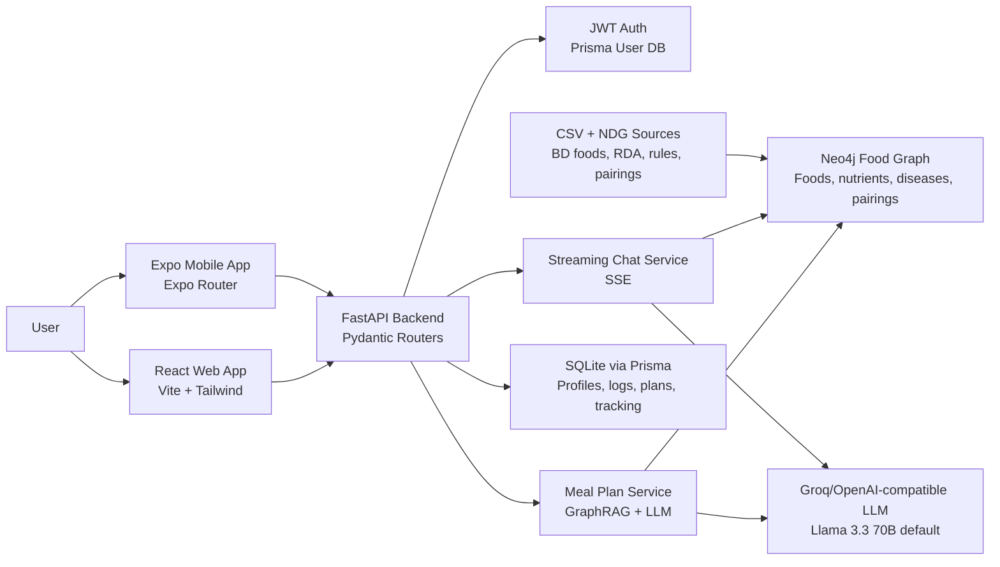

# DesiDiet Personalised Nutrition Engine

Infinity AI Buildfest Hackathon documentation and developer guide

DesiDiet is an AI-native personalised nutrition platform for Bangladesh. It combines a FastAPI backend, Neo4j GraphRAG knowledge graph, Prisma-backed user data, a React web dashboard, and an Expo mobile app to deliver culturally relevant meal planning, food safety explanations, meal tracking, medicine reminders, and nutrition reports.

The project was built for the Infinity AI Buildfest Hackathon as a practical nutrition engine rather than a generic diet chatbot. It grounds recommendations in Bangladeshi food data, disease-aware dietary rules, RDA-style nutrient targets, local meal pairing logic, and a streaming LLM experience.

> Medical disclaimer: DesiDiet provides educational nutrition assistance. It is not a medical device, diagnosis system, or replacement for a physician, dietitian, or emergency service.

## Table of Contents

- [Project Goals](#project-goals)
- [Core Capabilities](#core-capabilities)
- [System Architecture](#system-architecture)
- [Repository Map](#repository-map)
- [Technology Stack](#technology-stack)
- [Data and Knowledge Graph](#data-and-knowledge-graph)
- [AI and GraphRAG Pipeline](#ai-and-graphrag-pipeline)
- [Backend Guide](#backend-guide)
- [Frontend Guide](#frontend-guide)
- [Mobile Guide](#mobile-guide)
- [API Reference](#api-reference)
- [Database Schema](#database-schema)
- [Demo Flow](#demo-flow)
- [Validation and Testing](#validation-and-testing)
- [Hackathon Evaluation Notes](#hackathon-evaluation-notes)
- [Contribution Guidelines](#contribution-guidelines)
- [Known Limitations](#known-limitations)

## Quick Start — Full Command List

Complete step-by-step commands to start **every** service from scratch. Run each group in a **separate terminal**. Commands are shown for both **PowerShell (Windows)** and **Bash (Linux/macOS)**.

### 0 — Prerequisites

| Requirement | Version |
| --- | --- |
| Python | 3.11+ |
| Node.js | 18+ |
| Docker | Any recent version (for Neo4j) |
| Groq / OpenAI API key | Set in `backend/.env` |

### 1 — Start Neo4j (Terminal 1)

```bash
docker run -d ^
  --name desidiet-neo4j ^
  -p 7474:7474 ^
  -p 7687:7687 ^
  -e NEO4J_AUTH=neo4j/khadok2025 ^
  neo4j:5
```

> **Linux / macOS** — replace `^` with `\`:
> ```bash
> docker run -d \
>   --name desidiet-neo4j \
>   -p 7474:7474 \
>   -p 7687:7687 \
>   -e NEO4J_AUTH=neo4j/khadok2025 \
>   neo4j:5
> ```

Verify Neo4j is running:

```
http://localhost:7474
```

> [!NOTE]
> If you already have a Neo4j Desktop instance running on the same ports, skip the Docker command and just make sure it is started with the credentials in `backend/.env`.

### 2 — Backend Setup & Start (Terminal 2)

#### 2a — Create virtual environment (first time only)

**PowerShell (Windows):**
```powershell
cd backend
python -m venv venv
.\venv\Scripts\Activate.ps1
pip install -r requirements.txt
```

**Bash (Linux/macOS):**
```bash
cd backend
python -m venv venv
source venv/bin/activate
pip install -r requirements.txt
```

> [!TIP]
> If `pip` cannot read `requirements.txt` (it is UTF-16 LE encoded), convert it first:
> ```bash
> iconv -f UTF-16LE -t UTF-8 requirements.txt > /tmp/req.txt && pip install -r /tmp/req.txt
> ```

#### 2b — Generate Prisma client & push schema (first time only)

```bash
python -m prisma generate
python -m prisma db push
```

#### 2c — Migrate data into Neo4j graph (first time only)

```bash
python migrate_to_graph.py
python migrate_food_compatibility.py
```

#### 2d — Start the FastAPI server

**PowerShell (Windows):**
```powershell
.\venv\Scripts\Activate.ps1
uvicorn app.main:app --reload --host 127.0.0.1 --port 8000
```

**Bash (Linux/macOS):**
```bash
source venv/bin/activate
uvicorn app.main:app --reload --host 127.0.0.1 --port 8000
```

Verify the backend:

```
http://127.0.0.1:8000/health
http://127.0.0.1:8000/docs
```

### 3 — Frontend Web App (Terminal 3)

```bash
cd frontend
npm install
npm run dev
```

The web app will be available at:

```
http://localhost:3421
```

### 4 — Mobile App (Terminal 4, optional)

```bash
cd mobile
cp .env.example .env          # edit EXPO_PUBLIC_API_URL if needed
npm install
npm start                     # or: npx expo start
```

Other mobile launch options:

```bash
npm run android               # Android emulator
npm run ios                   # iOS simulator
npm run web                   # Web preview
```

> [!IMPORTANT]
> For a **physical device**, edit `mobile/.env` and set `EXPO_PUBLIC_API_URL` to your computer's LAN IP, e.g. `http://192.168.1.10:8000`.

### Port Reference

| Service | URL | Default Port |
| --- | --- | --- |
| Neo4j Browser | `http://localhost:7474` | 7474 |
| Neo4j Bolt | `bolt://localhost:7687` | 7687 |
| FastAPI Backend | `http://127.0.0.1:8000` | 8000 |
| Vite Web App | `http://localhost:3421` | 3421 |
| Expo Mobile (Metro) | Shown in terminal | 8081 / 19006 |

### Verification Checklist

```bash
# Backend health
curl http://127.0.0.1:8000/health

# Neo4j graph count (from Cypher browser or CLI)
MATCH (n) RETURN count(n);

# Frontend — open in browser
http://localhost:3421

# Swagger API docs
http://127.0.0.1:8000/docs
```

---

## Project Goals

DesiDiet is designed around four goals:

1. Personalise nutrition with real user context: age, gender, weight, height, activity level, goals, conditions, preferences, health logs, and completed meals.
2. Make recommendations locally useful: rice, dal, fish, vegetables, snacks, cooked dishes, Bangladeshi dietary patterns, and Bengali-first UX.
3. Explain food safety and nutrient reasoning: GraphRAG retrieves safe foods, disease nutrients, RDA contribution, compatible meal slots, and pairings before the LLM speaks.
4. Provide a complete product loop: onboard, generate a plan, track meals, ask the AI nutritionist, analyse swaps, manage medicine reminders, and review progress reports.

## Core Capabilities

### Personal nutrition profile

- Phone or email based registration and login.
- JWT access and refresh token flow.
- Profile wizard for name, age, gender, weight, height, activity, goal, conditions, preferred foods, and disliked foods.
- Calorie target calculation using Mifflin-St Jeor, South Asian BMI categories, ideal body weight, goal adjustments, and macro targets.

### Disease-aware food intelligence

- Safe food retrieval for diabetes, hypertension, heart disease, renal conditions, liver disease, pregnancy, lactation, elderly nutrition, cancer, tuberculosis, hypothyroidism, diarrhea, weight loss, and weight gain rules.
- Neo4j food graph search by Bangla or English names.
- Food detail and justification endpoints.
- AI food insights for search results and meal builder decisions.

### Meal planning

- Daily and weekly AI meal plans.
- Breakfast, snacks, lunch, and dinner slot logic.
- Meal pairing support through graph relationships.
- Calorie scaling against the user's target.
- Completed-slot tracking and micronutrient progress cards.
- Feedback, regeneration, editing, and swap workflows in the web app.

### AI nutrition chat

- Server-Sent Events streaming chat.
- Context includes profile, nutrition targets, health logs, current meal plan, recent tracking, and GraphRAG food context.
- Guided diet-plan chat session that collects missing profile data conversationally, saves the profile, and generates a plan.

### Meal logging and meal builder

- Natural-language meal logging such as "I ate rice, dal and fish at lunch".
- LLM extraction of foods, calories, macros, feedback, and warnings.
- Custom meal builder for analysing proposed meals or swaps.
- Safety grades, warnings, suggestions, and macro estimates.

### Reports and reminders

- Nutrition report with calorie, macro, BMI, ideal weight, and latest health information.
- Condition report with weekly summary and AI narrative.
- 3, 7, and 10 day health summary endpoint for charts.
- Medicine reminder parsing from natural language.
- Mobile profile screen supports medicine add/list/delete and notification preference UI.

### Web and mobile clients

- React web app for landing pages, authentication, profile, chat, meal plans, food explorer, health logs, reports, and medicine reminders.
- Expo mobile app with Bengali-first auth, onboarding, home dashboard, chat, meal plan, meal builder, meal tracker, report, profile, settings, and medicine reminders.

## System Architecture



### Buildfest eight-layer mapping

| Layer | Implementation |
| --- | --- |
| User Interaction | React 18 web app, Expo React Native mobile app, Bengali-first flows, streaming chat UI |
| Application Logic | FastAPI routers, Pydantic schemas, JWT dependencies, Prisma data access |
| AI Intelligence | OpenAI-compatible async client, Groq default base URL, Llama 3.3 70B default model, strict JSON prompts |
| Knowledge Retrieval | Neo4j GraphRAG, SentenceTransformer disease matching, RDA contribution ranking, NDG-derived rules |
| Agent Orchestration | `meal_plan_service.py`, diet-plan chat service, meal builder, meal tracking, medicine parsing |
| Data Infrastructure | Prisma Client Python, SQLite dev database, Neo4j graph, CSV data ingestion scripts |
| Automation and Integration | SSE streaming, Vite API proxy, medicine schedule extraction, report endpoints |
| Deployment Readiness | Docker-friendly Neo4j, Uvicorn backend, Vite frontend, Expo mobile workflow |

## Repository Map

```text
.
|-- README.md
|-- micronutrient_rich_foods.csv
|-- plan.md
|-- docs/
|   |-- architecture.md
|   |-- DesiDiet Arhitecture.png
|   `-- DesiDiet.docx
|-- backend/
|   |-- app/
|   |   |-- main.py
|   |   |-- config.py
|   |   |-- db.py
|   |   |-- dependencies.py
|   |   |-- schemas.py
|   |   |-- routers/
|   |   |-- services/
|   |   |-- core/
|   |   |-- logic/
|   |   `-- models/
|   |-- rag_engine/
|   |-- data/
|   |-- scripts/
|   |-- prisma/
|   |-- migrate_to_graph.py
|   |-- migrate_food_compatibility.py
|   |-- validate_project.py
|   |-- requirements.txt
|   `-- validation output CSV/TXT files
|-- frontend/
|   |-- src/
|   |   |-- App.tsx
|   |   |-- main.tsx
|   |   |-- pages/
|   |   |-- components/
|   |   |-- contexts/
|   |   |-- hooks/
|   |   |-- lib/
|   |   `-- types/
|   |-- public/
|   |-- docs/
|   |-- package.json
|   |-- vite.config.ts
|   `-- tailwind.config.js
`-- mobile/
    |-- app/
    |   |-- (auth)/
    |   |-- (tabs)/
    |   `-- _layout.tsx
    |-- components/
    |-- context/
    |-- hooks/
    |-- lib/
    |-- store/
    |-- assets/
    |-- app.json
    `-- package.json
```

Generated or local-only folders such as `frontend/node_modules`, `frontend/dist`, `frontend/.vite`, `backend/venv`, `.DS_Store`, and the SQLite database are not the source of truth for implementation decisions.

## Technology Stack

| Area | Stack |
| --- | --- |
| Backend API | Python, FastAPI, Pydantic, Uvicorn |
| Auth | JWT, password hashing, HTTP bearer dependencies |
| Relational data | Prisma Client Python, SQLite development database |
| Knowledge graph | Neo4j driver, Cypher queries, graph migration scripts |
| AI client | OpenAI-compatible async client, Groq default endpoint |
| Embeddings and ranking | SentenceTransformers, scikit-learn/numpy style similarity flow |
| Web frontend | React 18, TypeScript, Vite, Tailwind CSS, Framer Motion, Recharts, i18next, lucide-react |
| Mobile frontend | Expo, React Native, Expo Router, TanStack Query, Zustand, AsyncStorage, react-native-sse, lucide-react-native |
| Data | Bangladeshi foods CSV, RDA CSV, disease nutrient CSV, food pairing CSV, food compatibility CSV, NDG-derived rule data |

## Data and Knowledge Graph

### Data Sources

The project compiles and references the following data sources to build its Neo4j knowledge graph:

1. **National Dietary Guidelines for Bangladesh** (`NationalDietaryGuidelinesforBangladesh-23Aug2025.pdf`): The official guidelines which provide local dietary targets, safety rules, and regional eating habit recommendations.
2. **Explainable GraphRAG Research Reference** (`frai-9-1808444.pdf`): *Dindukurthi V, Jain D, Tripathi A, Obbineni JM and Kandasamy I (2026) An explainable graph retrieval augmented generation framework for personalized nutrition recommendation. Front. Artif. Intell. 9:1808444. doi: 10.3389/frai.2026.1808444*. A core research and dietary reference document used to map nutritional values, food composition rules, and medical condition criteria.
3. **Food Composition Table for Bangladesh**: *Institute of Nutrition and Food Science, Centre for Advanced Research in Sciences, University of Dhaka, Dhaka-1000, Bangladesh*. The authoritative nutritional database used for mapping macro and micro-nutrients of local Bangladeshi foods.

### Important data files


| File | Purpose |
| --- | --- |
| `backend/data/BD_food_details.csv` | Bangladeshi food nutrient dataset with food code, English/Bangla names, groups, calories, macros, micronutrients, and related nutrient columns |
| `backend/data/Indian_RDA.csv` | RDA values by nutrient, age group, gender, and unit |
| `backend/data/disease_nutrients.csv` | Disease-to-nutrient recommendation mapping |
| `backend/data/nutrients_abbreviations.csv` | Nutrient code, name, and tag mapping |
| `backend/data/food_pairings.csv` | Food-to-food pairing relationships with popularity, type, and slot |
| `backend/data/food_compatibility.csv` | Meal slot compatibility, food roles, and pairing groups |
| `backend/scripts/preprocessing/bd_foods_clean.csv` | Cleaned food data generated by preprocessing |
| `backend/scripts/preprocessing/ndg_foods.csv` | National Dietary Guidelines aligned food entries |
| `micronutrient_rich_foods.csv` | Root-level micronutrient-rich food reference |

### Graph migration scripts

Use these for the current graph setup:

```bash
cd backend
python migrate_to_graph.py
python migrate_food_compatibility.py
```

The active migration path loads foods, nutrients, RDA data, diseases, pairings, meal slots, and compatibility relationships into Neo4j.

Avoid using older migration experiments for new deployments unless you review them first. In particular, `backend/scripts/build_graph.py` and `backend/scripts/migrate_to_graph.py` contain stale assumptions from earlier project structure.

### Key graph concepts

| Concept | Description |
| --- | --- |
| Food | Bangladeshi food items with nutrient values and names |
| Nutrient | Protein, carbohydrate, fat, vitamins, minerals, and other nutrition dimensions |
| Disease | Condition nodes used for disease-specific nutrition needs |
| MealSlot | Breakfast, snacks, lunch, dinner, and compatibility metadata |
| RDA | Recommended dietary values by age/gender/nutrient |
| Pairing | Food combinations through `PAIRS_WITH` and compatibility relationships |

## AI and GraphRAG Pipeline

### Target calculation

`backend/rag_engine/calorie_engine.py` calculates:

- BMI and South Asian BMI category.
- Basal metabolic rate using Mifflin-St Jeor.
- Activity-adjusted TDEE.
- Goal-adjusted daily calories.
- Ideal body weight using Devine-style logic.
- Macro split: protein, carbohydrate, fat.
- Fiber and water targets.

### Disease-aware ranking

`backend/rag_engine/planner.py` performs the clinical retrieval path:

1. Normalize profile conditions.
2. Match conditions semantically with `SentenceTransformer`.
3. Retrieve disease-relevant nutrients from Neo4j.
4. Map clinical nutrient terms to scientific column names.
5. Match the user to RDA keys by age and gender.
6. Rank foods by nutrient contribution against the user profile.
7. Return RAG-recommended foods with reasons.

### Meal generation

`backend/app/services/meal_plan_service.py` coordinates the main planning flow:

1. Load the user profile, latest health log, and nutrition targets.
2. Query GraphRAG for safe/recommended foods.
3. Retrieve food pairings and meal-slot compatible foods.
4. Ask the LLM for strict JSON daily or weekly meal plans.
5. Scale meal calories toward the target.
6. Save the plan in Prisma.
7. Expose completed-slot and micronutrient progress to clients.

### Chat generation

`backend/app/routers/chat.py` streams chat replies with:

- User profile.
- Calculated targets.
- Latest health log.
- Today's plan.
- Recent meal tracking.
- GraphRAG food context.
- Conversation history.

The mobile and web apps consume the stream using Server-Sent Events.

## Backend Guide

### Backend prerequisites

- Python 3.11+ recommended.
- Neo4j 5.x.
- SQLite for development.
- A Groq or OpenAI-compatible API key.
- Node/npm only if you also run the web or mobile clients.

### Environment variables

Create or update `backend/.env`:

```env
DATABASE_URL="file:./prisma/dev.db"

NEO4J_URI="bolt://localhost:7687"
NEO4J_USER="neo4j"
NEO4J_PASSWORD="khadok2025"

JWT_SECRET="replace-with-a-long-random-secret"
JWT_ALGORITHM="HS256"
ACCESS_TOKEN_EXPIRE_MINUTES=30
REFRESH_TOKEN_EXPIRE_DAYS=7

LLM_API_KEY="replace-with-your-provider-key"
LLM_BASE_URL="https://api.groq.com/openai/v1"
LLM_MODEL="llama-3.3-70b-versatile"
LLM_MAX_TOKENS=1024

APP_NAME="DesiDiet Personalised Nutrition Engine"
CORS_ORIGINS="http://localhost:5173,http://localhost:8081,http://localhost:19006"
```

The root `.env` is used for Neo4j mode and Docker/cloud connection settings. Do not commit real secrets.

### Start Neo4j locally

```bash
docker run -d \
  --name desidiet-neo4j \
  -p 7474:7474 \
  -p 7687:7687 \
  -e NEO4J_AUTH=neo4j/khadok2025 \
  neo4j:5
```

Neo4j Browser will be available at:

```text
http://localhost:7474
```

### Install backend dependencies

```bash
cd backend
python -m venv venv
source venv/bin/activate
pip install -r requirements.txt
```

Note: `backend/requirements.txt` is currently encoded as UTF-16 LE. If your `pip install` cannot read it, convert during install:

```bash
iconv -f UTF-16LE -t UTF-8 requirements.txt > /tmp/desidiet-requirements.txt
pip install -r /tmp/desidiet-requirements.txt
```

The code also imports runtime packages such as Prisma Client Python, the OpenAI-compatible client, JWT/password tooling, and Neo4j. If a fresh environment reports missing imports, install the missing runtime package and update `backend/requirements.txt` so the environment remains reproducible.

### Prepare Prisma and SQLite

```bash
cd backend
python -m prisma generate
python -m prisma db push
```

If the `prisma` executable is available directly, these are equivalent:

```bash
prisma generate
prisma db push
```

The development database is stored at `backend/prisma/dev.db`.

### Build the Neo4j knowledge graph

```bash
cd backend
python migrate_to_graph.py
python migrate_food_compatibility.py
```

Optional validation:

```bash
python validate_project.py
```

Existing validation artifacts include:

- `backend/coverage_results.txt`
- `backend/latency_results.csv`
- `backend/rank_stability.csv`
- `backend/cosine_distribution.csv`

### Run the backend

```bash
cd backend
source venv/bin/activate
uvicorn app.main:app --reload --host 127.0.0.1 --port 8000
```

Useful URLs:

```text
http://127.0.0.1:8000/health
http://127.0.0.1:8000/docs
http://127.0.0.1:8000/redoc
```

### Backend application structure

| Path | Responsibility |
| --- | --- |
| `backend/app/main.py` | FastAPI app creation, CORS, lifespan, router registration, health endpoint |
| `backend/app/config.py` | Pydantic settings loaded from `.env` |
| `backend/app/db.py` | Prisma and Neo4j lifecycle wiring |
| `backend/app/dependencies.py` | JWT bearer authentication helpers |
| `backend/app/schemas.py` | API request and response schemas |
| `backend/app/core/security.py` | Password hashing and JWT creation/verification |
| `backend/app/core/llm_client.py` | Async OpenAI-compatible chat and streaming client |
| `backend/app/routers/` | API route modules |
| `backend/app/services/meal_plan_service.py` | Main AI meal plan orchestration |
| `backend/app/services/diet_plan_chat_service.py` | Guided chat-based profile and diet-plan flow |
| `backend/rag_engine/` | Calorie engine, food engine, dietary rules, GraphRAG planner |
| `backend/prisma/schema.prisma` | Relational schema |

## Frontend Guide

The web app is a Vite React application in `frontend/`.

### Web prerequisites

- Node.js 18+.
- Running backend at `http://127.0.0.1:8000`.

### Install and run

```bash
cd frontend
npm install
npm run dev
```

Default Vite URL:

```text
http://localhost:5173
```

The Vite config proxies these API routes to the backend:

```text
/auth
/profile
/health-logs
/meal-plans
/chat
/foods
/reports
/meal-tracking
/medicine-reminders
/meal-builder
```

### Web scripts

```bash
npm run dev
npm run build
npm run lint
npm run preview
```

### Web app routes

| Route | Screen |
| --- | --- |
| `/` | Public landing page |
| `/about` | About/story page |
| `/conditions` | Medical conditions and safety page |
| `/auth` | Login/register |
| `/chat` | Protected AI nutrition chat |
| `/profile` | Protected profile wizard/details |
| `/health-log` | Protected health logging and trends |
| `/meal-plan` | Protected daily/tomorrow/history meal planner |
| `/medicine` | Protected medicine reminder UI |
| `/foods` | Protected food search and food safety explorer |
| `/report` | Protected nutrition report and charts |

### Web implementation notes

- `frontend/src/lib/api.ts` centralizes authenticated API calls, refresh-token retry, SSE chat support, and module-specific clients.
- `frontend/src/contexts/AuthContext.tsx` manages auth state and profile refresh.
- `frontend/src/lib/i18n.ts` contains English and Bengali interface strings.
- `frontend/src/pages/MealPlan.tsx` is the most complete web workflow: plan generation, editing, slot completion, feedback, food justification, and micronutrient progress.
- `frontend/src/pages/ReportPage.tsx` renders 3/7/10 day health report charts.
- `frontend/public/` and `frontend/docs/` hold the visual assets used by the landing and docs surfaces.

## Mobile Guide

The mobile app is an Expo React Native application in `mobile/`.

### Mobile prerequisites

- Node.js 18+.
- Expo CLI through `npx expo`.
- Running backend accessible from the simulator/device.

### Configure API URL

Create `mobile/.env` from the sample:

```bash
cd mobile
cp .env.example .env
```

For iOS simulator or web, localhost can work:

```env
EXPO_PUBLIC_API_URL=http://localhost:8000
```

For a physical phone, use the computer's LAN IP:

```env
EXPO_PUBLIC_API_URL=http://192.168.1.10:8000
```

### Install and run

```bash
cd mobile
npm install
npm start
```

Other common Expo commands:

```bash
npm run android
npm run ios
npm run web
```

### Mobile app flows

| Area | Files | Capability |
| --- | --- | --- |
| Root app setup | `mobile/app/_layout.tsx` | Font loading, React Query provider, auth/settings hydration |
| Auth | `mobile/app/(auth)/login.tsx`, `register.tsx`, `welcome.tsx` | Bengali login, registration, token storage |
| Onboarding | `mobile/app/(auth)/onboarding/` | Seven-step profile setup and target summary |
| Tabs | `mobile/app/(tabs)/_layout.tsx` | Protected tab navigation |
| Home | `mobile/app/(tabs)/home.tsx` | Calories, macros, plan snapshot, medicine reminders, health snapshot |
| Chat | `mobile/app/(tabs)/chat.tsx` | SSE AI nutrition chat |
| Diet-plan chat | `mobile/app/(tabs)/diet-plan.tsx` | Guided plan creation conversation |
| Meals | `mobile/app/(tabs)/meals.tsx` | Plan, builder, and tracker tabs |
| Plan view | `mobile/components/meals/MealPlanView.tsx` | Daily/weekly plans, generate, mark complete, swap |
| Builder | `mobile/components/meals/MealBuilderView.tsx` | Food search, custom meal analysis, safety grade |
| Tracker | `mobile/components/meals/MealTrackerView.tsx` | Natural-language meal logging |
| Report | `mobile/app/(tabs)/report.tsx` | Weekly report cards and charts |
| Profile | `mobile/app/(tabs)/profile.tsx` | Profile, medicine reminders, notification switch, language toggle, logout |

### Mobile state and networking

- `mobile/lib/api.ts` uses Axios with JWT injection and refresh-token retry.
- `mobile/store/auth-store.ts` stores auth state with Zustand and AsyncStorage.
- `mobile/store/onboarding-store.ts` stores onboarding draft data.
- `mobile/store/settings-store.ts` stores language, notification preference, and meal times.
- `mobile/lib/query-client.ts` configures TanStack Query caching.
- `mobile/hooks/useHaptics.ts` wraps Expo haptics.

## API Reference

Base URL for local development:

```text
http://127.0.0.1:8000
```

### System

| Method | Path | Purpose |
| --- | --- | --- |
| `GET` | `/` | Root API metadata |
| `GET` | `/health` | Health check |
| `POST` | `/api/generate-plan` | Legacy Q1 journal-style diet plan endpoint |

### Auth

| Method | Path | Purpose |
| --- | --- | --- |
| `POST` | `/auth/register` | Register by phone/email and password |
| `POST` | `/auth/login` | Login and receive access/refresh tokens |
| `POST` | `/auth/refresh` | Refresh tokens |
| `GET` | `/auth/me` | Return current authenticated user |

### Profile

| Method | Path | Purpose |
| --- | --- | --- |
| `POST` | `/profile` | Create or upsert profile |
| `GET` | `/profile` | Get profile and calculated targets |
| `PATCH` | `/profile` | Update profile fields |

### Health logs

| Method | Path | Purpose |
| --- | --- | --- |
| `POST` | `/health-logs` | Create health log |
| `GET` | `/health-logs` | List health logs |
| `GET` | `/health-logs/trends` | Weight and blood sugar trends |

### Meal plans

| Method | Path | Purpose |
| --- | --- | --- |
| `GET` | `/meal-plans/daily` | Get or generate daily meal plan |
| `GET` | `/meal-plans/weekly` | Get or generate weekly meal plans |
| `GET` | `/meal-plans/history` | List plan history |
| `POST` | `/meal-plans/{plan_id}/feedback` | Submit plan feedback score |
| `PATCH` | `/meal-plans/{plan_id}/mark-complete` | Mark a meal slot complete/incomplete |
| `PATCH` | `/meal-plans/{plan_id}/edit` | Edit plan data |

### Chat

| Method | Path | Purpose |
| --- | --- | --- |
| `POST` | `/chat` | Stream nutrition chat reply over SSE |
| `POST` | `/chat/diet-plan-session` | Stream guided profile and diet-plan chat |

### Foods

| Method | Path | Purpose |
| --- | --- | --- |
| `GET` | `/foods/search?q=` | Search food graph |
| `GET` | `/foods/safe-foods` | Return profile-safe foods |
| `GET` | `/foods/search-with-insight?q=&slot=` | Search foods with AI insight and safety label |
| `GET` | `/foods/{code}` | Food details |
| `GET` | `/foods/{code}/justify` | Explain why a food is safe/caution/avoid |

### Reports

| Method | Path | Purpose |
| --- | --- | --- |
| `GET` | `/reports/nutrition` | Nutrition targets and profile summary |
| `GET` | `/reports/conditions` | Condition-aware weekly summary |
| `POST` | `/reports/send-email` | Simulated email report action |
| `GET` | `/reports/health-summary?days=7` | Calorie, macro, micronutrient, and weight chart data |

### Meal tracking

| Method | Path | Purpose |
| --- | --- | --- |
| `POST` | `/meal-tracking` | Natural-language meal log and AI nutrition estimate |
| `GET` | `/meal-tracking/today` | Today's tracked meals |

### Medicine reminders

| Method | Path | Purpose |
| --- | --- | --- |
| `POST` | `/medicine-reminders` | Parse and save medicine schedule |
| `GET` | `/medicine-reminders` | List active medicine reminders |
| `DELETE` | `/medicine-reminders/{id}` | Soft-delete reminder |

### Meal builder

| Method | Path | Purpose |
| --- | --- | --- |
| `POST` | `/meal-builder/analyze` | Analyse custom meal items for calories, macros, safety, grade, warnings, and suggestions |

## Database Schema

Prisma schema file:

```text
backend/prisma/schema.prisma
```

Models:

| Model | Purpose |
| --- | --- |
| `User` | Authentication identity, phone/email, password hash, language |
| `Profile` | Demographics, anthropometrics, activity, goal, conditions, food preferences |
| `HealthLog` | Weight, blood pressure, sugar, HbA1c, notes, symptoms |
| `MealPlan` | Daily/weekly plans, JSON plan data, calorie targets, language, feedback, completed slots |
| `ChatMessage` | Stored chat messages |
| `MealTracking` | Natural-language meal logs, extracted items, calories, macros, AI feedback |
| `MedicineReminder` | Parsed medicine name, dose, times, days, food relation, notes, active flag |

JSON-like fields are stored as strings in SQLite and converted through helpers in `backend/app/utils.py`.

## Demo Flow

Use this flow for a hackathon judge or first-time developer walkthrough:

1. Start Neo4j, migrate graph data, and run the FastAPI backend.
2. Start the web app or Expo mobile app.
3. Register a user with a phone number and password.
4. Complete the profile wizard:
   - age, gender, height, weight
   - activity level
   - goal
   - medical conditions
   - preferences/allergies
5. Open the nutrition report to show BMI, calorie target, macro target, and ideal body weight.
6. Generate a daily meal plan.
7. Open a meal item justification or use food search to show GraphRAG safety reasoning.
8. Mark one meal slot complete and observe progress changes.
9. Log an unplanned meal in natural language.
10. Use the meal builder to analyse a swap or custom plate.
11. Ask the AI nutritionist a personalised question.
12. Add a medicine reminder using natural language.
13. Open the 7-day report to show charts and AI narrative.

## Validation and Testing

### Backend smoke checks

```bash
curl http://127.0.0.1:8000/health
```

Open:

```text
http://127.0.0.1:8000/docs
```

### Graph validation

```bash
cd backend
python validate_project.py
```

Review:

- `coverage_results.txt`
- `latency_results.csv`
- `rank_stability.csv`
- `cosine_distribution.csv`

### Frontend checks

```bash
cd frontend
npm run build
npm run lint
```

### Mobile checks

```bash
cd mobile
npm run web
```

For native smoke testing:

```bash
npm run android
npm run ios
```

### Manual test checklist

- Register/login works.
- Profile create/update works.
- `/profile` returns targets.
- Neo4j is connected before meal plan generation.
- Daily plan returns valid JSON with meal slots.
- Chat stream emits tokens and ends cleanly.
- Meal tracking saves calories/macros.
- Meal builder returns a grade and warnings/suggestions.
- Food search returns Bangla/English names.
- Medicine reminder parser returns name, dose, time, and with-food metadata.
- Frontend proxy reaches backend.
- Mobile `EXPO_PUBLIC_API_URL` points to a reachable backend host.

## Hackathon Evaluation Notes

### AI-native value

DesiDiet is not a thin LLM wrapper. The LLM is constrained by:

- User profile targets.
- Health logs.
- GraphRAG food retrieval.
- Disease-specific nutrient rules.
- RDA contribution ranking.
- Meal-slot compatibility.
- Food pairings.
- Strict JSON output contracts.

### Local relevance

The system uses Bangladeshi food names, Bengali UI copy, local dietary patterns, local meal slots, and NDG-style dietary rules. This is important for adoption because many generic diet apps overfit Western foods and serving assumptions.

### Explainability

Food safety and recommendations are explainable through graph data, not only generated prose. The app can justify a food choice, classify safe/caution/avoid, and show why a plan matches a user's conditions.

### Business Model & Monetization

DesiDiet uses a **Freemium** subscription model combined with **Affiliate Marketing**:
- **7-Day Premium Trial:** Users receive full access to all premium features for the first 7 days.
- **Free Tier:** After the trial, users have limited access (e.g., 10 chatbot messages, generation of only the current day's meal plan with basic macronutrient details). Advanced features like reports, medicine reminders, and detailed micronutrient tracking are locked.
- **Premium Tier:** For a subscription fee of **300 BDT per month**, users unlock full access to all features.
- **Brand Promotion / Affiliate Revenue:** Meal plans and food recommendations integrate with local grocery and food delivery platforms like **Foodpanda, Shwapno, and Chaldal**. This serves as a strong B2B monetization channel through brand promotion and affiliate commissions.

### Full product loop

The project includes:

- Backend API.
- Knowledge graph ingestion.
- Web client.
- Mobile client.
- Auth.
- Profile management.
- AI chat.
- Meal plans.
- Meal tracking.
- Meal builder.
- Medicine reminders.
- Reports.

That breadth makes it suitable for a live hackathon demo and future product iteration.

## Contribution Guidelines

### General rules

- Keep secrets out of git. Use `.env` files and redacted examples.
- Keep data migrations reproducible. When CSV schemas change, update migration scripts and validation outputs together.
- Keep user-facing advice grounded in profile, graph, and clinical rule context.
- Add explicit medical disclaimers for high-risk health guidance.
- Preserve Bengali support in new UX flows.
- Keep generated folders out of reviews unless the change is specifically about build output.

### Backend guidelines

- Add Pydantic request/response schemas in `backend/app/schemas.py`.
- Add new endpoints under `backend/app/routers/`.
- Put orchestration logic in `backend/app/services/`.
- Put graph retrieval logic in `backend/rag_engine/`.
- Keep LLM prompts strict about JSON when the client depends on structured output.
- Validate Neo4j query changes with `validate_project.py` or focused Cypher checks.

### Frontend guidelines

- Use `frontend/src/lib/api.ts` for API calls.
- Use existing page/component patterns before adding new global state.
- Keep dashboard routes protected.
- Keep Bengali and English strings aligned when touching i18n.
- Prefer existing Tailwind tokens and component styles.

### Mobile guidelines

- Use `mobile/lib/api.ts` for API calls.
- Use TanStack Query for server state.
- Use Zustand stores only for local auth/settings/onboarding state.
- Keep physical-device API URLs configurable through `EXPO_PUBLIC_API_URL`.
- Keep Bengali-first copy consistent across auth, onboarding, tabs, and forms.

## Known Limitations

- The backend currently depends on Neo4j for the full GraphRAG experience. Without Neo4j, core food search and safe-food logic will be incomplete.
- LLM-powered features require a valid `LLM_API_KEY`.
- Some internal names still reference earlier project names such as `Khadok-Bangla AI` or `PushtiAI`; this README uses the hackathon-facing product name, DesiDiet.
- `backend/requirements.txt` is UTF-16 LE and may need conversion for some package managers.
- The requirements file may not list every runtime import used by the current code. Update it after confirming a clean setup.
- Legacy files such as `plan.md`, older graph scripts, and some docs mention earlier assumptions like xAI, PostgreSQL, Redis, or old `graphRAG` paths. Treat the current FastAPI, SQLite, Prisma, Neo4j, Groq/OpenAI-compatible implementation as canonical.
- `frontend/dist` is generated build output.
- `backend/prisma/dev.db` is a local development SQLite database and should not be used as production data storage.
- Email sending is currently simulated in the report router.
- Mobile notification UI exists, but full native scheduled notifications need production wiring.

## Production Readiness Roadmap

- Move from SQLite to PostgreSQL for multi-user deployment.
- Add automated backend tests for auth, profile targets, meal planning, chat streaming, and graph retrieval.
- Add frontend and mobile E2E smoke tests.
- Add CI checks for lint, typecheck, build, and migration validation.
- Add real email delivery and push notification scheduling.
- Add secrets management for deployment.
- Containerize backend, frontend, and graph setup.
- Add observability for LLM latency, graph latency, token usage, and recommendation quality.
- Add clinician review workflow for high-risk condition guidance.

## License and Use

This repository is prepared for the Infinity AI Buildfest Hackathon. Before public release or clinical use, review data licensing, medical safety requirements, security posture, and deployment compliance.
