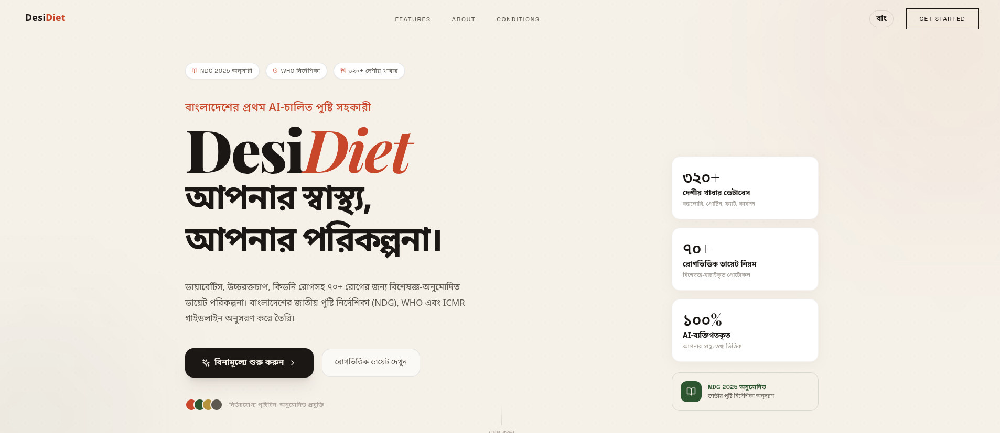
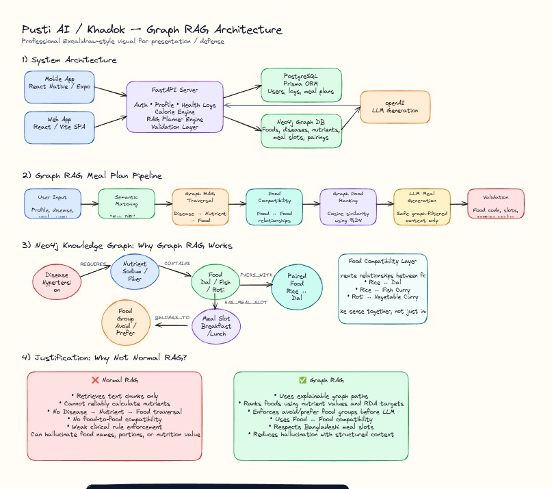
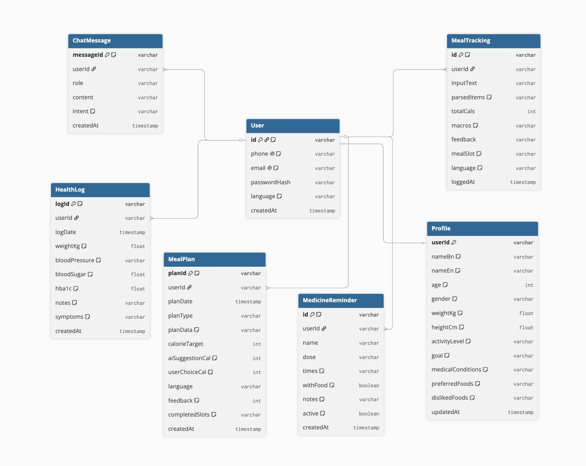
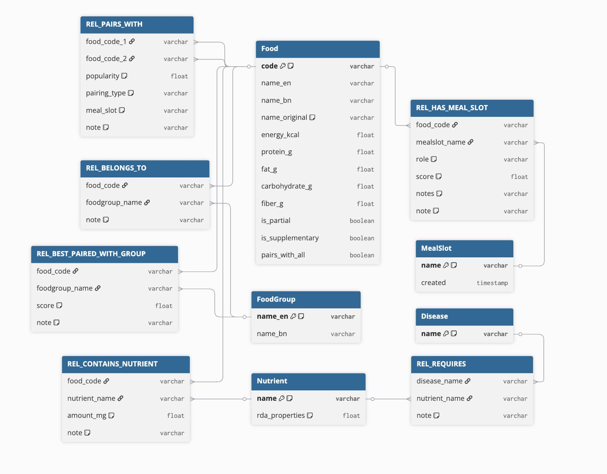

# DesiDiet — Pusti AI



Pusti AI is a personalized nutrition and diet planning platform designed for Bangladeshi users. It combines a Graph-RAG (Retrieval-Augmented Generation) food knowledge graph with an OpenAI-compatible large language model to deliver clinically grounded, culturally relevant meal plans, dietary guidance, and health tracking in both Bengali and English.

The project was built for the Infinity AI Buildfest 2026 competition.

---

## Table of Contents

- [Overview](#overview)
- [Key Features](#key-features)
- [System Architecture](#system-architecture)
- [Technology Stack](#technology-stack)
- [Project Structure](#project-structure)
- [Quick Start](#quick-start)
- [Environment Variables](#environment-variables)
- [API Overview](#api-overview)
- [Documentation](#documentation)
- [Deployment](#deployment)

---

## Overview

Pusti AI addresses a significant gap in South Asian digital health tools: the absence of a nutrition platform that understands Bangladeshi food culture, local dietary patterns, and the high prevalence of conditions such as diabetes, hypertension, and anemia in the region.

The platform ingests the National Dietary Guidelines of Bangladesh (NDG 2025) and structures food, nutrient, and condition relationships into a Neo4j knowledge graph. At query time, a Graph-RAG pipeline retrieves contextually relevant food data and injects it into LLM prompts, ensuring that all nutritional values and dietary recommendations are database-verified rather than hallucinated.

---

## Key Features

**Personalized Meal Planning**
AI-generated daily and weekly meal plans based on user profile, medical conditions, activity level, and dietary goals. Plans are built from verified food database entries and comply with NDG 2025 macronutrient distribution targets.

**Conversational AI Diet Assistant**
A streaming SSE chat interface powered by an OpenAI-compatible LLM. The assistant has full access to the user's profile, today's meal plan, recent meal logs, and health history as in-context data. It is strictly scoped to food and nutrition topics and refuses all unrelated queries.

**Meal Logging via Natural Language and Vision**
Users can log meals by typing descriptions in Bengali or English, or by uploading a food photograph. The system uses the LLM to identify food items and quantities, then looks up verified nutritional data from Neo4j before saving the log. LLM-generated nutrition values are never used; only database values are accepted.

**Health Log and Trend Tracking**
Users record weight, blood pressure, blood sugar, and HbA1c readings over time. The system surfaces trends and integrates this data into personalized LLM context.

**Food Knowledge Browser**
Users can search the food database by name (Bengali or English), view full macronutrient and micronutrient profiles, and receive condition-aware safety ratings (safe / caution / avoid) based on their medical profile.

**Health and Nutrition Reports**
The report engine aggregates calorie adherence, macro consumption, weight history, and condition-specific clinical insights over configurable time windows. Reports can be sent by email.

**Medicine Reminder Parsing**
Users describe their medicine schedule in natural language and the system extracts structured reminders (name, dose, times, food pairing instructions).

**Meal Builder**
An interactive tool for constructing custom meals by selecting and weighing individual food items. The system evaluates the assembled meal against the user's nutrition targets and condition constraints, returning an AI-generated insight.

**NutriSaathi / Personal Cooker**
A condition-specific personalized cooking assistant that generates culturally grounded Bangladeshi recipes, suggests ingredient alternatives, and performs medical-profile-based safety checks for users with chronic conditions.

**Bilingual Interface**
All user-facing content, meal plan data, and AI responses are delivered in Bengali (default) or English depending on user preference.

**Voice Input and Realtime Session**
The chat interface supports audio recording transcribed via OpenAI Whisper. A WebRTC-based realtime voice session endpoint is also available for live conversational interaction.

---

## System Architecture

The application is structured across four scalable layers:

1. **L1 Client (React Vite+TS, Expo React Native):** Web pages (Auth, Dashboard, Chat, MealPlan, HealthLog, Medicine, Report, Conditions, Profile) and Mobile app (Home, Chat, Diet-Plan, Meals, Report, Profile). Communicates via HTTPS/REST.
2. **L2 API Gateway (FastAPI + Uvicorn, JWT, SSE):** Groups functionalities into conceptual services without exposing explicit routes: Auth Services, Feature Services (Profiles, Health Logs, Foods), Meal & Cooking Services (Plans, Builder), and Chat Services (SSE Streaming).
3. **L3 Intelligence (GraphRAG, Pinecone RAG, Calorie Engine):** Meal Plan Service, Diet Chat Service, GraphRAG Planner, Calorie Engine (BMI, TDEE, Macros), and the **NutriSaathi / Personal Cooker Service**, which drives condition-specific recipe generation.
4. **L4 Data (Neo4j, Pinecone, PostgreSQL/Prisma, OpenAI GPT-4):** **Neo4j** acts as a **food compatibility store** utilized to **suggest traditional meal combinations**. **Pinecone** acts as a vector DB storing embedded recipes. **PostgreSQL** handles relational state (User, Profile, Logs, Plans). **OpenAI API** handles LLM inferences.

### Data Flow

- ① Client (Web/Mobile) sends HTTPS/REST request or opens SSE stream for real-time chat.
- ② FastAPI API Gateway authenticates via JWT and delegates to the correct internal service group.
- ③ Intelligence Layer processes the request — querying Pinecone for relevant recipe vectors and querying Neo4j via Cypher for food-nutrient-disease graph knowledge.
- ④ PostgreSQL (Prisma ORM) is read/written for user profiles, health logs, meal history, and medicine reminders via SQL/ORM.
- ⑤ OpenAI GPT-4 API is called for language-model inference (chat, meal generation, medicine parsing, NutriSaathi recipe synthesis).
- ⑥ Response returns as JSON over HTTPS/REST or as a token stream over SSE to the client.

See [docs/Project_Summary.md](docs/Project_Summary.md) for the detailed architecture diagram and summary.

### Architecture & Data Models

**1. Graph RAG Pipeline & Architecture:**  


**2. PostgreSQL Relational Schema (Prisma):**  


**3. Neo4j Graph Database Schema:**  


---

## Technology Stack

**Backend & Intelligence**

| Component | Technology |
|---|---|
| Web Framework | FastAPI 0.116 (with Uvicorn) |
| Relational DB & ORM | PostgreSQL + Prisma Client Python 0.15 |
| Graph Database | Neo4j (Food compatibility store & traditional meal combinations) |
| Vector Database | Pinecone (Recipe retrieval for NutriSaathi) |
| LLM & AI Models | OpenAI GPT-4 / Whisper (via OpenAI Python SDK) |
| GraphRAG Engine | Neo4j + SentenceTransformer (`planner.py`) |
| Auth & Security | JWT (python-jose), bcrypt |
| Data Validation | Pydantic v2 |
| Containerization | Docker |

**Frontend**

| Component | Technology |
|---|---|
| Framework | React 18 + TypeScript |
| Build Tool | Vite 4 |
| Routing | React Router v6 |
| Styling | Tailwind CSS 3 |
| Animation | Framer Motion |
| Charts | Recharts |
| Icons | Lucide React |
| i18n | i18next |

---

## Project Structure

```
DesiDiet/
├── backend/
│   ├── app/
│   │   ├── main.py              # FastAPI app entry point, router registration
│   │   ├── config.py            # Pydantic Settings, all env var definitions
│   │   ├── db.py                # Prisma client, Neo4j init, lifespan handler
│   │   ├── dependencies.py      # JWT auth dependency injection
│   │   ├── schemas.py           # All Pydantic request/response DTOs
│   │   ├── utils.py             # JSON serialization helpers
│   │   ├── core/
│   │   │   ├── llm_client.py    # Async LLM client (chat, stream, TTS, Whisper, Realtime)
│   │   │   └── security.py      # Password hashing, JWT create/decode
│   │   ├── logic/
│   │   │   └── planner.py       # Q1 journal plan logic (Neo4j + SentenceTransformer)
│   │   ├── models/
│   │   │   └── schemas.py       # Q1 journal input/output models
│   │   ├── routers/
│   │   │   ├── auth.py          # POST /auth/register, /login, /refresh; GET /auth/me
│   │   │   ├── chat.py          # POST /chat (SSE), /chat/diet-plan-session, /chat/transcribe
│   │   │   ├── foods.py         # GET /foods/search, /foods/safe-foods, /foods/{code}
│   │   │   ├── health_log.py    # POST/GET /health-logs
│   │   │   ├── meal_builder.py  # POST /meal-builder/analyze
│   │   │   ├── meal_plan.py     # GET /meal-plans/daily, /weekly, /history
│   │   │   ├── meal_tracking.py # POST /meal-tracking, /meal-tracking/from-image
│   │   │   ├── medicine.py      # POST/GET/DELETE /medicine-reminders
│   │   │   ├── profile.py       # POST/PATCH/GET /profile
│   │   │   └── report.py        # GET /reports/nutrition, /health-summary; POST /reports/send-email
│   │   └── services/
│   │       ├── meal_plan_service.py        # Core meal plan generation logic
│   │       └── diet_plan_chat_service.py   # Conversational diet plan collection
│   ├── rag_engine/
│   │   ├── __init__.py          # Public API: KhadokGraphRAG, calculate_targets, NDG_DIETARY_RULES
│   │   ├── calorie_engine.py    # NDG 2025 BMR/TDEE/IBW calculator (Mifflin-St Jeor)
│   │   ├── dietary_rules_data.py # Static NDG dietary rules indexed by condition
│   │   ├── food_engine.py       # Neo4j Cypher queries: search, safe foods, context
│   │   └── planner.py           # SentenceTransformer RAG-based food recommender
│   ├── prisma/
│   │   └── schema.prisma        # Database schema (User, Profile, MealPlan, etc.)
│   ├── requirements.txt
│   ├── Dockerfile
│   └── start.sh
└── frontend/
    ├── src/
    │   ├── App.tsx              # Root router, auth guards, layout wrappers
    │   ├── pages/               # One file per route
    │   ├── components/          # Reusable UI components by domain
    │   ├── contexts/            # AuthContext, SubscriptionContext
    │   ├── hooks/               # Custom React hooks
    │   ├── lib/
    │   │   └── api.ts           # Full typed API client for all backend endpoints
    │   └── types/               # Shared TypeScript type definitions
    ├── index.html
    ├── vite.config.ts
    ├── tailwind.config.js
    └── vercel.json
```

---

## Quick Start

### Prerequisites

- Python 3.11 or higher
- Node.js 18 or higher
- PostgreSQL database (local or hosted)
- Neo4j instance (local or AuraDB cloud)
- An OpenAI API key (or compatible provider such as Groq or OpenRouter)

### Backend

```bash
cd backend

# Create and activate a virtual environment
python -m venv venv
source venv/bin/activate          # Windows: venv\Scripts\activate

# Install dependencies
pip install -r requirements.txt

# Copy and configure environment variables
cp .env.example .env
# Edit .env with your DATABASE_URL, NEO4J credentials, JWT_SECRET, LLM_API_KEY

# Generate the Prisma client
python -m prisma generate

# Apply database migrations
python -m prisma db push

# Start the development server
uvicorn app.main:app --reload --host 0.0.0.0 --port 8000
```

The API will be available at `http://localhost:8000`. Interactive documentation is at `http://localhost:8000/docs`.

### Frontend

```bash
cd frontend

# Install dependencies
npm install

# Configure the API base URL
echo "VITE_API_URL=http://localhost:8000" > .env

# Start the development server
npm run dev
```

The frontend will be available at `http://localhost:5173`.

---

## Environment Variables

All backend configuration is loaded from a `.env` file in the `backend/` directory. The full reference is in [docs/backend-setup.md](docs/backend-setup.md).

| Variable | Description | Default |
|---|---|---|
| `DATABASE_URL` | PostgreSQL connection string | Required |
| `NEO4J_URI` | Neo4j Bolt URI | `bolt://localhost:7687` |
| `NEO4J_USER` | Neo4j username | `neo4j` |
| `NEO4J_PASSWORD` | Neo4j password | Required |
| `JWT_SECRET` | Secret key for JWT signing (min 32 chars) | Required |
| `JWT_ALGORITHM` | JWT signing algorithm | `HS256` |
| `ACCESS_TOKEN_EXPIRE_MINUTES` | Access token lifetime | `30` |
| `REFRESH_TOKEN_EXPIRE_DAYS` | Refresh token lifetime | `7` |
| `LLM_API_KEY` | API key for the LLM provider | Required |
| `LLM_BASE_URL` | Base URL for the LLM endpoint | `https://api.openai.com/v1` |
| `LLM_MODEL` | Model name | `gpt-4o-mini` |
| `LLM_MAX_TOKENS` | Maximum tokens per completion | `1024` |
| `CORS_ORIGINS` | Comma-separated list of allowed CORS origins | `*` |
| `APP_NAME` | Application name shown in health check | `Pusti AI` |

The frontend requires one environment variable:

| Variable | Description |
|---|---|
| `VITE_API_URL` | Backend base URL (no trailing slash) |

---

## API Overview

The backend exposes a REST + SSE API at version 2.0.0. All protected endpoints require a Bearer JWT in the `Authorization` header.

| Prefix | Description |
|---|---|
| `POST /auth/register` | Register a new user with phone or email |
| `POST /auth/login` | Authenticate and receive tokens |
| `POST /auth/refresh` | Exchange a refresh token for a new access token |
| `GET /auth/me` | Get the current authenticated user |
| `GET /profile` | Get profile and computed nutrition targets |
| `POST /profile` | Create a user profile |
| `PATCH /profile` | Update a user profile |
| `POST /health-logs` | Log a health measurement |
| `GET /health-logs` | List recent health logs |
| `GET /health-logs/trends` | Get weight and blood sugar trend data |
| `GET /meal-plans/daily` | Get or generate today's meal plan |
| `GET /meal-plans/weekly` | Get the weekly meal plan |
| `POST /chat` | Stream an AI chat response via SSE |
| `POST /chat/diet-plan-session` | Stream a guided diet plan building session |
| `POST /chat/transcribe` | Transcribe an audio recording |
| `POST /chat/realtime/session` | Mint an ephemeral WebRTC realtime session |
| `GET /foods/search` | Search the food database |
| `GET /foods/safe-foods` | List condition-safe foods for the user |
| `GET /foods/{code}` | Get full nutritional detail for a food item |
| `POST /meal-tracking` | Log a meal from a text description |
| `POST /meal-tracking/from-image` | Log a meal from a photograph |
| `GET /meal-tracking/today` | List today's logged meals |
| `POST /medicine-reminders` | Add a medicine reminder from natural language |
| `GET /medicine-reminders` | List active medicine reminders |
| `POST /meal-builder/analyze` | Analyze a custom-built meal |
| `GET /reports/nutrition` | Get a full nutrition report |
| `GET /reports/health-summary` | Get a time-windowed health summary |
| `POST /reports/send-email` | Email a health report to the user |
| `POST /api/generate-plan` | Q1 journal direct plan generation endpoint |

Full request and response schemas are documented in [docs/api-reference.md](docs/api-reference.md).

---

## Documentation

| Document | Description |
|---|---|
| [docs/architecture.md](docs/architecture.md) | System design, Graph-RAG pipeline, data flow |
| [docs/api-reference.md](docs/api-reference.md) | All endpoints with request/response schemas |
| [docs/backend-setup.md](docs/backend-setup.md) | Backend installation and configuration guide |
| [docs/frontend-setup.md](docs/frontend-setup.md) | Frontend installation and build guide |
| [docs/data-models.md](docs/data-models.md) | PostgreSQL schema and Neo4j graph model |

---

## Deployment

**Backend**

The backend is containerized via Docker. To build and run:

```bash
cd backend
docker build -t desi-diet-backend .
docker run -p 8000:8000 --env-file .env desi-diet-backend
```

The current production backend is deployed on Render at `https://desi-diet-backend.onrender.com`.

**Frontend**

The frontend is a static site after building. No Node.js server is required at runtime.

```bash
cd frontend
npm run build
# Deploy the contents of frontend/dist/ to any static host
```

The current production frontend is configured for Vercel deployment using `vercel.json`, which rewrites all routes to `index.html` for client-side routing support.

To deploy to Vercel:

```bash
cd frontend
npx vercel --prod
```

Set `VITE_API_URL` as an environment variable in the Vercel project settings pointing to the backend URL.
