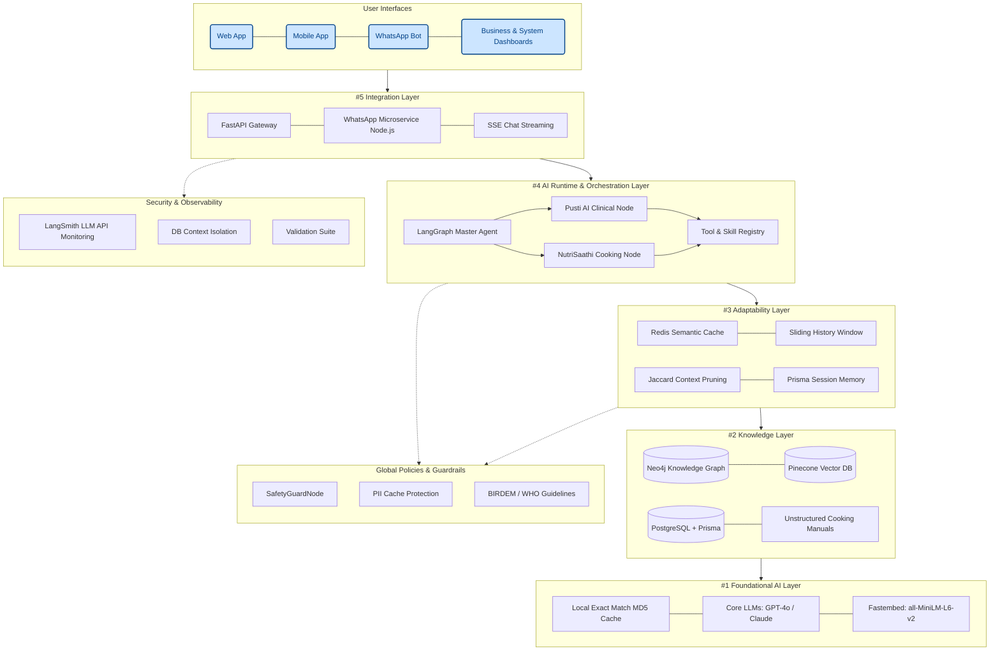
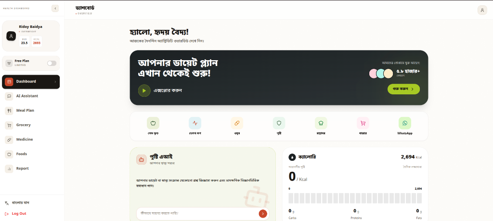
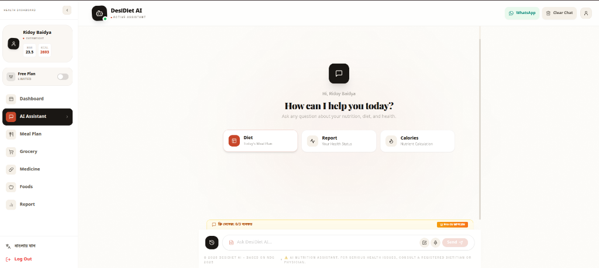
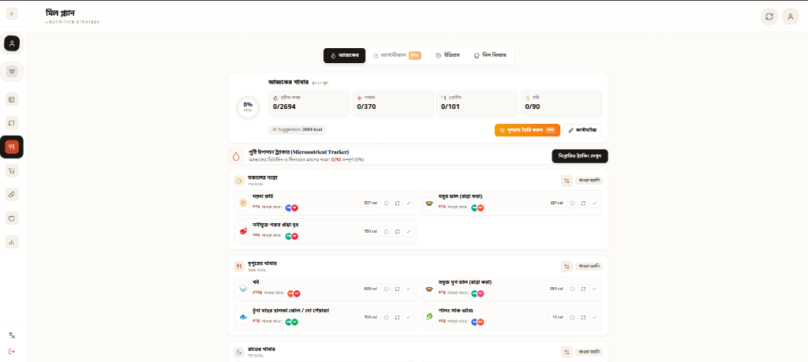
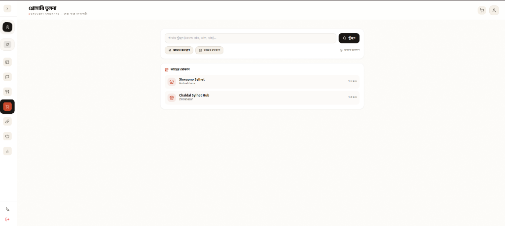
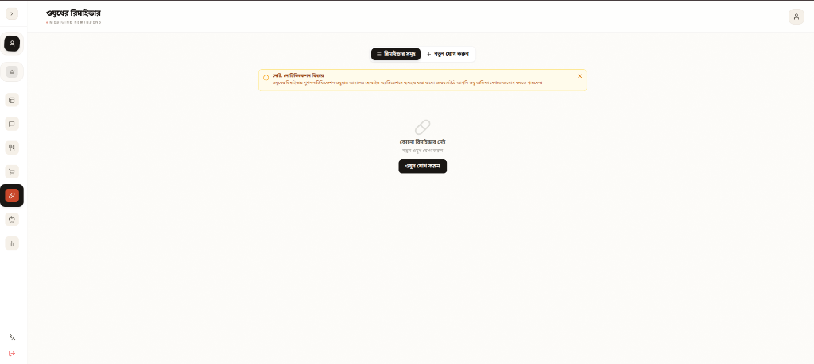
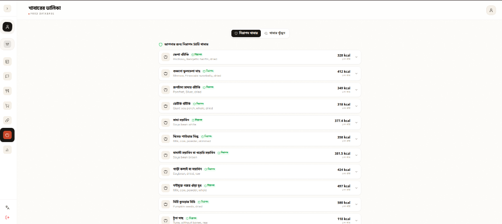
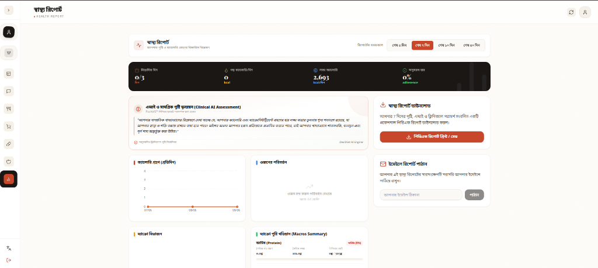

# **DesiDiet — AI-Native Clinical Nutrition & Meal Planning** 

[](https://github.com/LegendaryBeast/desi-diet-AI)
[](https://fastapi.tiangolo.com/)
[](https://www.postgresql.org/)
[](https://neo4j.com/)

> **Proudly Built for Infinity AI Buildfest 2026 @ BRAC University**
> **Web Application:** Deployed at Vercel & Railway.

---

## 🚀 Executive Summary & Core Innovation (20% Weight)

**DesiDiet** is an enterprise-grade, culturally grounded, clinical nutrition and meal planning ecosystem engineered to solve the unique dietary health challenges of the Bangladeshi and broader South Asian population. 

### The Problem
Traditional nutrition applications completely fail in South Asia. They do not comprehend native foods (e.g., *Shak*, *Ruti*, *Dal*, regional fish), nor do they clinically account for the high genetic predisposition to metabolic conditions like Type-2 Diabetes, Hypertension, and Micronutrient Deficiency (Anemia) prevalent in Bangladesh.

### Our Solution
DesiDiet introduces a **5-Layer AI Reference Architecture** powered by a dual-agent framework (**Pusti AI** & **NutriSaathi**) orchestrated via **LangGraph**. The platform enforces strict medical compliance by grounding Large Language Models with the **National Dietary Guidelines of Bangladesh (NDG 2025)** using a state-of-the-art **Hybrid RAG** engine.

---

## 🛠️ Technical Execution & System Architecture (20% Weight)

DesiDiet is designed around an AI-Native 5-Layer model that decouples integration, business logic, semantic optimization, and knowledge databases:


```mermaid
graph TB
    classDef l5 fill:#d4edda,stroke:#28a745,stroke-width:2px,color:#155724;
    classDef l4 fill:#fff3cd,stroke:#ffc107,stroke-width:2px,color:#856404;
    classDef l3 fill:#ffeeba,stroke:#fd7e14,stroke-width:2px,color:#854004;
    classDef l2 fill:#f8d7da,stroke:#dc3545,stroke-width:2px,color:#721c24;
    classDef l1 fill:#e2e3e5,stroke:#6c757d,stroke-width:2px,color:#383d41;
    classDef pillar fill:#fdfdfe,stroke:#6c757d,stroke-width:2px,stroke-dasharray: 4 4;
    classDef interface fill:#cce5ff,stroke:#004085,stroke-width:2px,color:#004085;

    subgraph Clients [User Interfaces]
        direction LR
        C1(Web App):::interface --- C2(Mobile App):::interface --- C3(WhatsApp Bot):::interface --- C4(Business & System Dashboards):::interface
    end

    subgraph L5 [#5 Integration Layer]
        direction LR
        I1[FastAPI Gateway] --- I2[WhatsApp Microservice Node.js] --- I3[SSE Chat Streaming]
    end

    subgraph L4 [#4 AI Runtime & Orchestration Layer]
        direction LR
        O1[LangGraph Master Agent]
        O2[Pusti AI Clinical Node]
        O3[NutriSaathi Cooking Node]
        O4[Tool & Skill Registry]
        O1 --> O2 & O3
        O2 & O3 --> O4
    end

    subgraph L3 [#3 Adaptability Layer]
        direction LR
        A1[Redis Semantic Cache] --- A2[Sliding History Window]
        A3[Jaccard Context Pruning] --- A4[Prisma Session Memory]
    end

    subgraph L2 [#2 Knowledge Layer]
        direction LR
        K1[(Neo4j Knowledge Graph)] --- K2[(Pinecone Vector DB)]
        K3[(PostgreSQL + Prisma)] --- K4[Unstructured Cooking Manuals]
    end

    subgraph L1 [#1 Foundational AI Layer]
        direction LR
        F1[Core LLMs: GPT-4o / Claude] --- F2[Fastembed: all-MiniLM-L6-v2]
        F3[Local Exact Match MD5 Cache] --- F1
    end

    Clients --> L5 --> L4 --> L3 --> L2 --> L1

    subgraph LeftPillar [Security & Observability]
        direction TB
        S1[LangSmith LLM API Monitoring]
        S2[DB Context Isolation]
        S3[Validation Suite]
    end

    subgraph RightPillar [Global Policies & Guardrails]
        direction TB
        G1[SafetyGuardNode]
        G2[PII Cache Protection]
        G3[BIRDEM / WHO Guidelines]
    end

    L5 -.-> LeftPillar
    L4 -.-> RightPillar
    L3 -.-> RightPillar
```

### 1. Hybrid RAG Architecture
*   **Graph RAG (Neo4j):** Houses the structured food composition database, medical compatibility constraints, and clinical relationships. Allows querying safe foods, calorie targets, and dietary combinations with zero LLM hallucination.
*   **Vector RAG (Pinecone & Fastembed):** Leverages `all-MiniLM-L6-v2` locally via ONNX Runtime (`Fastembed`) to index unstructured cooking manuals and recipes for the cooking assistant, avoiding external embedding costs.

### 2. Token & Latency Optimization
To bypass standard LLM latency and API costs, we implemented:
*   **Local Exact Match Cache:** Computes an MD5 hash of queries for exact cache hits, instantly resolving recurrent greetings or requests with zero LLM calls.
*   **Redis Semantic Cache:** Employs cosine similarity thresholds on query embeddings to retrieve previously generated responses in under 50ms.
*   **Jaccard Context Pruning:** Strips irrelevant tokens from context vectors locally before generating LLM prompts, staying strictly within the target token window.
*   **Sliding Window & Summarization:** Houses a 6-turn conversational history. Older messages are periodically condensed into a single context block via a smaller LLM (`gpt-4o-mini`).

---

## 📈 Business Model & Global Readiness (20% Weight)

DesiDiet is constructed to be a sustainable, market-ready enterprise, not just a hackathon prototype.

*   **B2B Corporate Wellness:** Licensing API streams and custom dashboards to corporate firms in Dhaka for employee health metrics, meal plans, and productivity mapping.
*   **Monetization Strategy:** Freemium SaaS model. Free tier offers daily meal tracking and AI chat. Premium tier opens 7-day personalized micronutrient cycling targets, deep health reports, and direct recipe alternatives.
*   **Cross-Border / Diaspora Expansion:** Bangladesh has a vast Non-Resident Bangladeshi (NRB) community. The architecture is ready to scale globally to help South Asian communities manage their health by mapping regional ingredients to localized grocery stores.

---

## 🛡️ Real-World Impact & Ethical AI Compliance (20% Weight)

### Clinical Grounding & Toxicity Prevention
We implemented deep, rule-based clinical safeguards on top of model inferences:
*   **Weekly Nutrient Cycling:** Programmatically schedules rotations (leafy greens on days 1,3,5; yellow veggies on days 2,4,6; seeds/dairy on day 7) to guarantee 100% daily micronutrient RDA coverage.
*   **Toxicity Thresholds:** Enforces limits on toxic accumulation (e.g., capping dark leafy greens to 100g/meal, organ meat to 75g/day, and blocking consecutive-day therapeutic food repetitions).
*   **SafetyGuardNode:** Prevents out-of-scope inquiries. It intercepts and blocks jailbreaks, clinical diagnoses, and drug prescription requests prior to reaching internal agents.
*   **PII Cache Protection:** Standardized filters prevent user-specific metrics or private parameters from leaking into shared semantic cache stores.

---

## 🌐 Scalability & Code Modularization (10% Weight)

DesiDiet is split into fully decoupled, containerized services:
*   **Backend REST/SSE API:** FastAPI running async workflows, easily scaleable horizontally behind a load balancer.
*   **WhatsApp Service:** A standalone Node.js microservice handling Twilio webhook ingress, separating chat interface traffic from core intelligence servers.
*   **Cross-Platform Clients:** Modular monorepo structuring React Vite (web app), Expo (React Native mobile application), and unified admin dashboards.

---

## 📸 Screenshots

| Dashboard Overview | AI Diet Assistant |
|:---:|:---:|
|  |  |
| **Personalized Meal Plan** | **Grocery Price Compare** |
|  |  |
| **Medicine Reminders** | **Food Database** |
|  |  |
| **Comprehensive Health Report** | |
|  | |

---

## ⚙️ Quick Start

### Prerequisites
*   Python 3.11+
*   Node.js 18+
*   PostgreSQL & Redis
*   Neo4j instance (Local or AuraDB)
*   OpenAI API Key

### Backend Ingress
```bash
cd backend
python -m venv venv
source venv/bin/activate

# Install and init ORM
pip install -r requirements.txt
cp .env.example .env
python -m prisma generate
python -m prisma db push

# Start Server
uvicorn app.main:app --reload --host 0.0.0.0 --port 8000
```

### Frontend Web Build
```bash
cd frontend
npm install
echo "VITE_API_URL=http://localhost:8000" > .env
npm run dev
```

### WhatsApp Microservice
```bash
cd whatsapp-service
npm install
npm run dev
```

---

## 🧪 Evaluation & Quality Measurement

Our custom validation suite regularly runs regression checks:
1.  **Recommendation Stability:** Verifies personalization variance among various demographic groups (Age/Gender/RDA keys).
2.  **Nutrient Coverage:** Confirms top recommendations meet clinical RDA targets.
3.  **Cache hit-rate analysis:** Measures semantic cache precision and Jaccard pruning token overlap rates.
4.  **BIRDEM Audits:** Cross-references plan outputs with BIRDEM clinical guidelines.
