<p align="center">
  <a href="https://youtu.be/b_bTzmIBPus" target="_blank">
    
  </a>
</p>

<p align="center">
  <a href="https://youtu.be/b_bTzmIBPus" target="_blank">
    
  </a>
</p>


# **DesiDiet — AI-Native Clinical Nutrition & Meal Planning** 

> **Proudly Built for Infinity AI Buildfest 2026 @ BRAC University**
> **Web Application:** Deployed at Vercel & Railway.


---

## Executive Summary & Core Innovation

**DesiDiet** is an enterprise-grade, culturally grounded, clinical nutrition and meal planning ecosystem engineered to solve the unique dietary health challenges of the Bangladeshi and South Asian population. 

### The Problem
Traditional nutrition applications fail in South Asia. They do not comprehend regional foods (e.g., *Shak*, *Ruti*, *Dal*, regional fish), nor do they clinically account for the high genetic predisposition to metabolic conditions like Type-2 Diabetes, Hypertension, and Micronutrient Deficiency (Anemia) prevalent in Bangladesh.

### Our Solution
DesiDiet introduces a 5-Layer AI Reference Architecture powered by a dual-agent framework (**Pusti AI** & **NutriSaathi**) orchestrated via **LangGraph**. The platform enforces strict medical compliance by grounding Large Language Models using a state-of-the-art **Hybrid RAG** engine backed by three core clinical data sources: the [National Dietary Guidelines for Bangladesh](docs/NationalDietaryGuidelinesforBangladesh-23Aug2025.pdf), the [Bangladeshi Food Composition Tables (FCT)](docs/FCT_10_2_14_final_version.pdf), and the clinical structures of the [Explainable GraphRAG Framework](docs/frai-9-1808444.pdf) (Dindukurthi et al., 2026).

### Expected Impact
DesiDiet addresses the critical shortage of practicing nutritionists in Bangladesh by providing scalable, expert-grounded clinical guidance. The platform aims to improve regional nutrition awareness, prevent metabolic diseases, and expand accessibility to personalized dietary support both locally and beyond borders.

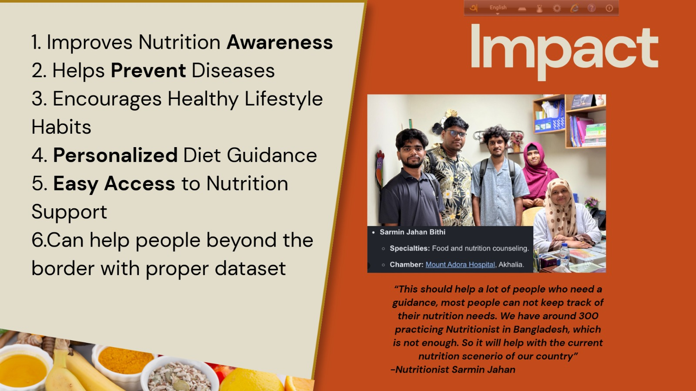

| |
|:---:|
| **Target Audience**<br>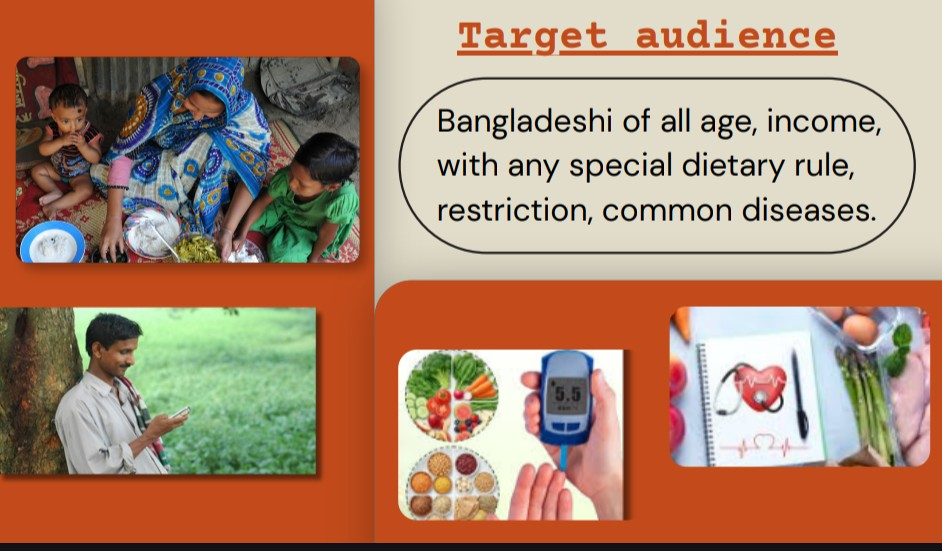 |

---

## Technical Execution & System Architecture

DesiDiet is designed around an AI-Native 5-Layer model that decouples integration, business logic, semantic optimization, and knowledge databases:


## Dataset & Integration Sources

DesiDiet is powered by a diverse ingestion layer combining peer-reviewed data sources, relational inputs, and validated synthetic sets:

*   **Open Datasets:** Grounded in the [National Dietary Guidelines for Bangladesh](docs/NationalDietaryGuidelinesforBangladesh-23Aug2025.pdf), [Bangladeshi Food Composition Tables (FCT)](docs/FCT_10_2_14_final_version.pdf), and clinical schemas adapted from the peer-reviewed study, [An Explainable GraphRAG Framework for Personalized Nutrition Recommendation](docs/frai-9-1808444.pdf) (Dindukurthi et al., 2026).
*   **External APIs:** OpenAI API (used for Whispering voice inputs and chat orchestration) and Pinecone Vector Database (hosting indexed recipe data).
*   **Internal Systems:** PostgreSQL relational database (via Prisma ORM) storing user profiles, logs, and targets, and a Neo4j Graph Database mapping complex food, nutrient, and disease relationships.
*   **Synthetic Data:** Automatically generated and updated food compatibility/pairing matrices, validated programmatically via AST structures.

---
## Platform Key Features & Screenshots

<table width="100%">
  <!-- Row 1 -->
  <tr>
    <td width="50%" align="center" valign="top">
      <strong>1. Personalized Meal Planning</strong><br>
      AI-generated daily/weekly plans matching user profile, health status, and NDG 2025 targets.
    </td>
    <td width="50%" align="center" valign="top">
      <strong>2. Conversational AI Diet Assistant</strong><br>
      Real-time streaming SSE chat with full user profile context.
    </td>
  </tr>
  <tr>
    <td width="50%" align="center" valign="top">
      
    </td>
    <td width="50%" align="center" valign="top">
      
    </td>
  </tr>
  
  <!-- Row 2 -->
  <tr>
    <td width="50%" align="center" valign="top">
      <strong>3. Meal Logging via Speech & Vision</strong><br>
      Multi-lingual voice, text, or image food logging grounded in Neo4j.
    </td>
    <td width="50%" align="center" valign="top">
      <strong>4. Health Log & Trend Tracking</strong><br>
      Progress logging for weight, BP, blood sugar, and HbA1c with context injection.
    </td>
  </tr>
  <tr>
    <td width="50%" align="center" valign="top">
      
    </td>
    <td width="50%" align="center" valign="top">
      
    </td>
  </tr>

  <!-- Row 3 -->
  <tr>
    <td width="50%" align="center" valign="top">
      <strong>5. Food Knowledge Browser</strong><br>
      Multilingual search displaying full nutrition specs and medical safety warnings.
    </td>
    <td width="50%" align="center" valign="top">
      <strong>6. Health & Nutrition Reports</strong><br>
      PDF email reports analyzing calorie trends, macros, and clinical insights.
    </td>
  </tr>
  <tr>
    <td width="50%" align="center" valign="top">
      
    </td>
    <td width="50%" align="center" valign="top">
      
    </td>
  </tr>

  <!-- Row 4 -->
  <tr>
    <td width="50%" align="center" valign="top">
      <strong>7. Medicine Reminder Parsing</strong><br>
      Converts natural language descriptions of prescriptions into structured in-app reminders.
    </td>
    <td width="50%" align="center" valign="top">
      <strong>8. Interactive Meal Builder</strong><br>
      Interactive meal calculator with target matching and AI feedback.
    </td>
  </tr>
  <tr>
    <td width="50%" align="center" valign="top">
      
    </td>
    <td width="50%" align="center" valign="top">
      
    </td>
  </tr>

  <!-- Row 5 -->
  <tr>
    <td width="50%" align="center" valign="top">
      <strong>9. NutriSaathi Cooking Guide</strong><br>
      Personalized cooking assistant generating local recipes with health substitutions.
    </td>
    <td width="50%" align="center" valign="top">
      <strong>10. Bilingual Interface</strong><br>
      Entire application fully localized in Bengali and English.
    </td>
  </tr>
  <tr>
    <td width="50%" align="center" valign="top">
      
    </td>
    <td width="50%" align="center" valign="top">
      
    </td>
  </tr>

  <!-- Row 6 -->
  <tr>
    <td width="50%" align="center" valign="top">
      <strong>11. Grocery Sourcing & Price Compare</strong><br>
      Price-sorted local ingredient recommendations from nearest shops via GPS with live price comparison.
    </td>
    <td width="50%" align="center" valign="top">
      <strong>12. AI Chatbot</strong><br>
      Interactive conversational agent for instant nutrition tracking and dietary advice.
    </td>
  </tr>
  <tr>
    <td width="50%" align="center" valign="top">
      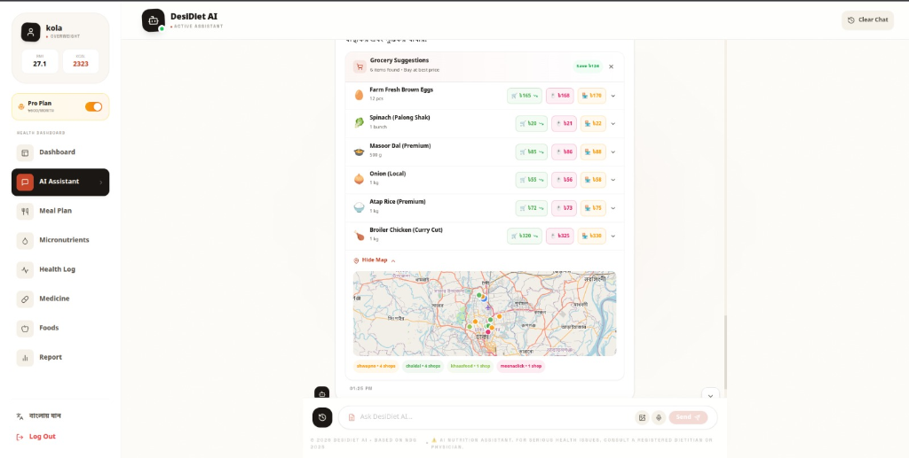
    </td>
    <td width="50%" align="center" valign="top">
      
    </td>
  </tr>
</table>


---

## Mobile App Experience

Our mobile-first web app is designed for accessibility on the go, bringing intelligent nutrition straight to the palm of your hand. 

| **1. Mobile Dashboard** | **2. Daily Meal Tracking** | **3. Pushti-AI Assistant** | **4. Target Goals & BMI** |
|:---:|:---:|:---:|:---:|
| 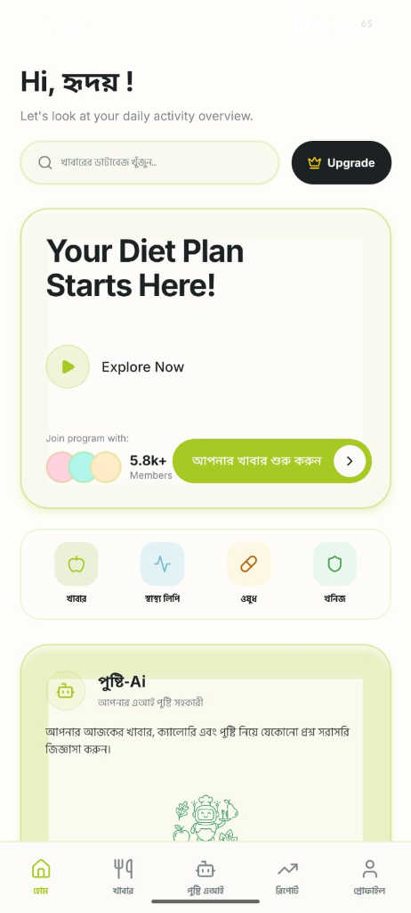 | 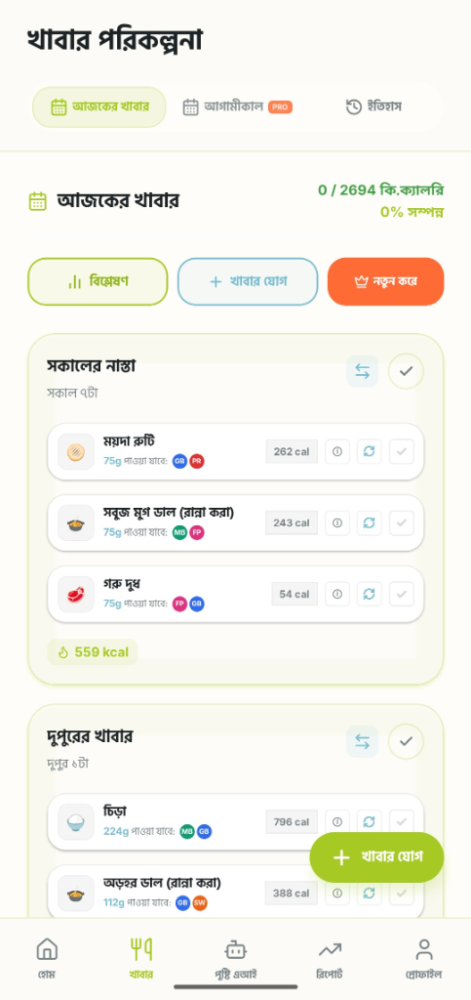 | 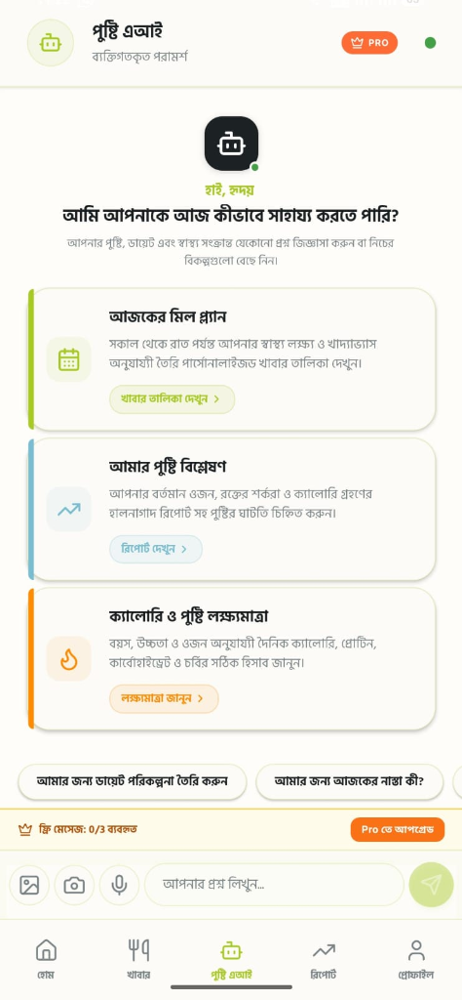 | 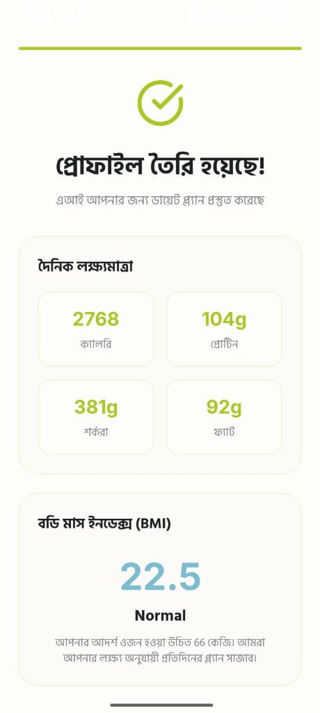 |
| **5. Health & Disease Setup** | **6. User Profile & Metrics** | **7. Pro Upgrade Flow** | **8. Health PDF Reports** |
| 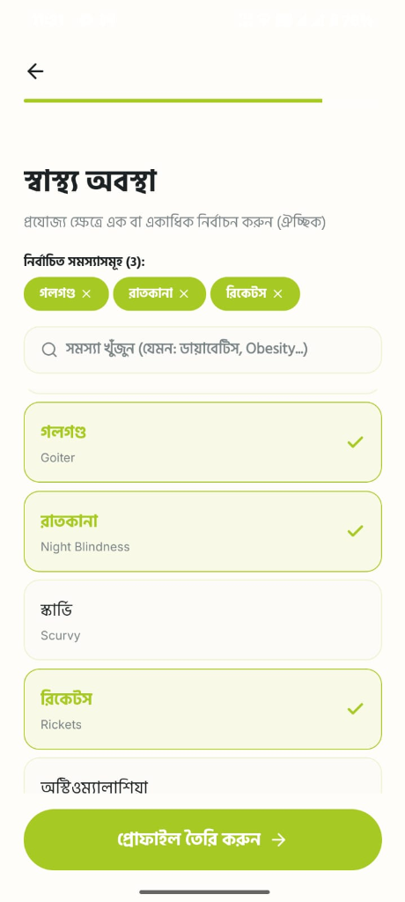 | 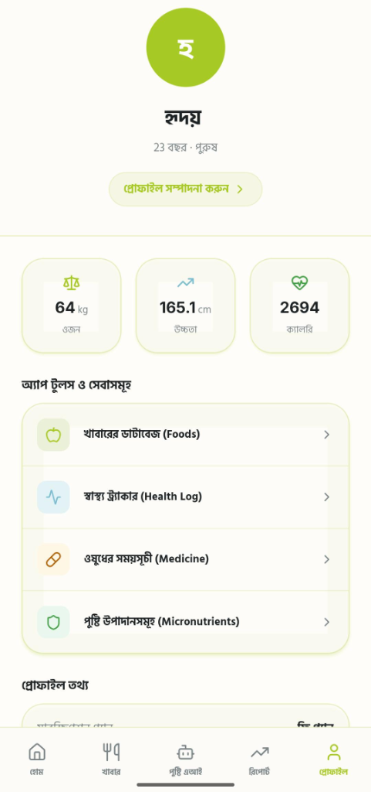 | 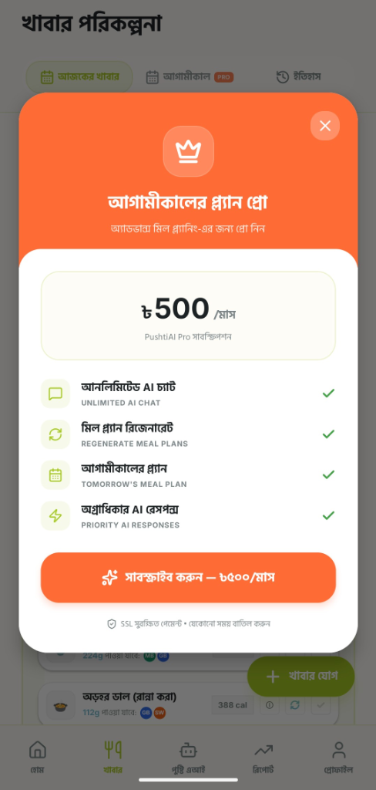 | 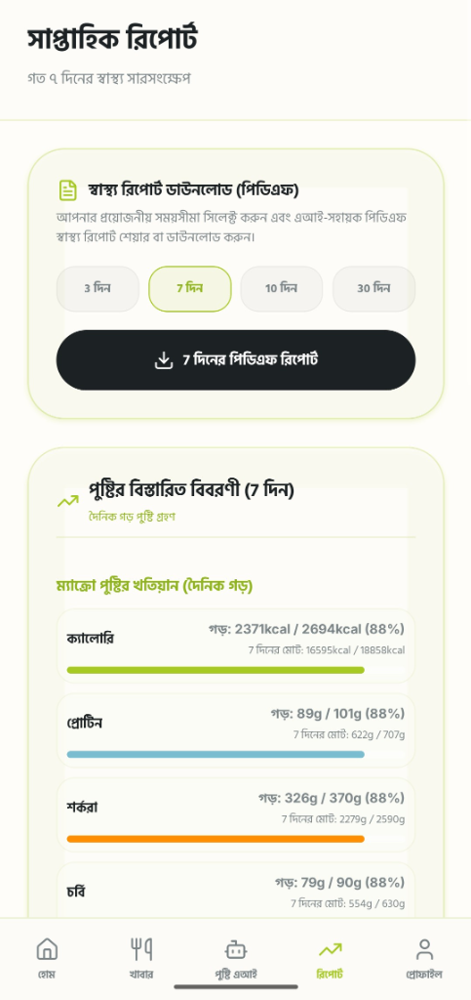 |

---

## WhatsApp Bot Integration

Chat directly with Pushti AI on WhatsApp without installing any app! Log meals, ask for advice, and get full dietary planning right from your favorite messaging app.

| **1. WhatsApp Meal Plans** | **2. WhatsApp Meal Logs** | **3. WhatsApp Nutrition Info** | **4. WhatsApp Health Advice** |
|:---:|:---:|:---:|:---:|
| 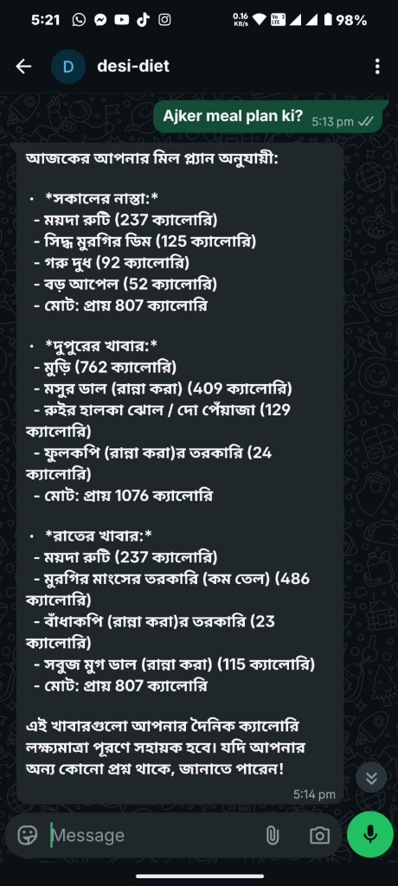 | 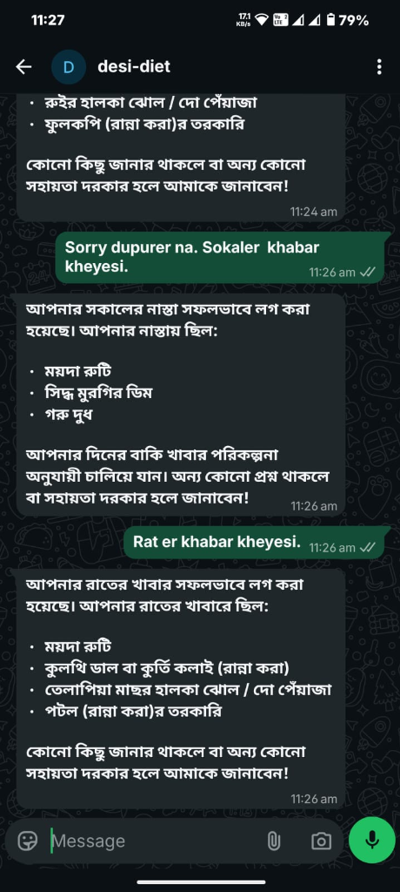 | 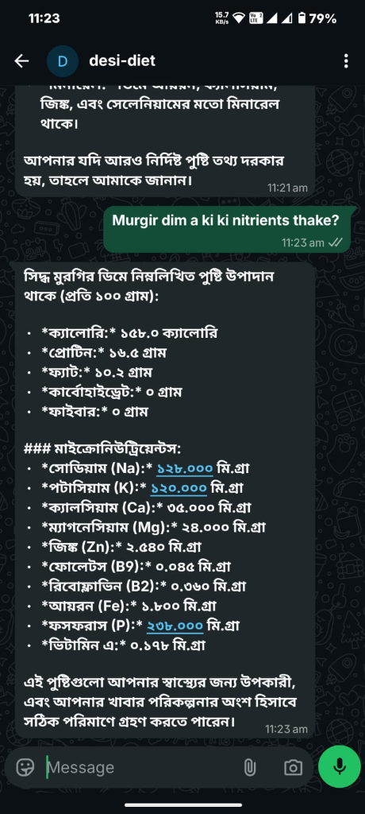 |  |


---

## DesiDiet Business (B2B Admin Portal)

<table width="100%">
  <!-- Row 1 -->
  <tr>
    <td width="50%" align="center" valign="top">
      <strong>1. Executive Overview Dashboard</strong><br>
      Real-time tracking of MRR, Active Subscriptions, Churn Rate, and L2C Funnel.
    </td>
    <td width="50%" align="center" valign="top">
      <strong>2. Revenue & Churn Analytics</strong><br>
      Deep dive into subscription mix, top brands revenue share, and actionable churn signals.
    </td>
  </tr>
  <tr>
    <td width="50%" align="center" valign="top">
      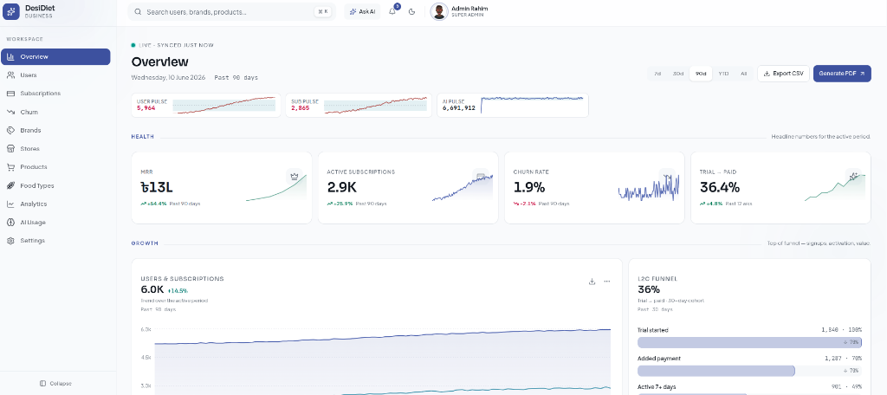
    </td>
    <td width="50%" align="center" valign="top">
      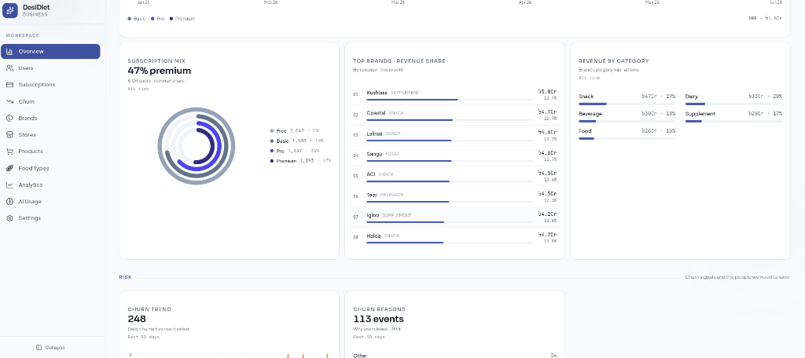
    </td>
  </tr>

  <!-- Row 2 -->
  <tr>
    <td width="50%" align="center" valign="top">
      <strong>3. Platform Operations & AI Telemetry</strong><br>
      Live activity logs, AI token consumption tracking by feature, and geographic user distribution.
    </td>
    <td width="50%" align="center" valign="top">
      <strong>4. Partner Brand Management</strong><br>
      Manage storefronts, catalog listings, and track brand performance via conversion vs revenue quadrants.
    </td>
  </tr>
  <tr>
    <td width="50%" align="center" valign="top">
      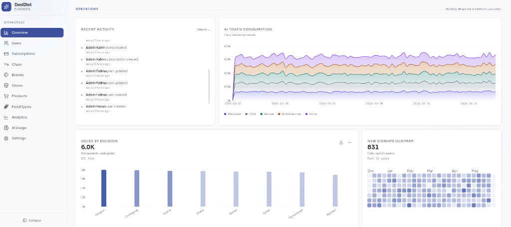
    </td>
    <td width="50%" align="center" valign="top">
      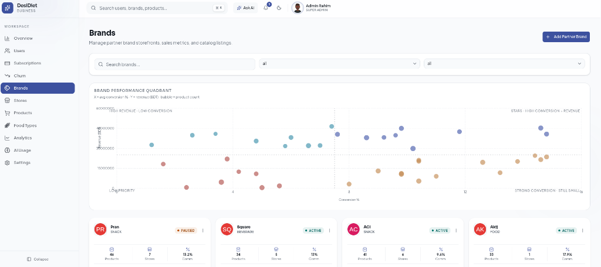
    </td>
  </tr>

  <!-- Row 3 -->
  <tr>
    <td width="50%" align="center" valign="top">
      <strong>5. Brand Performance Deep Dive</strong><br>
      Granular metrics for individual partner brands including revenue history, new customers, and product rating distribution.
    </td>
    <td width="50%" align="center" valign="top">
      <strong>6. Advanced Analytics & Cohorts</strong><br>
      Analyze user acquisition channels, cohort retention matrices, and customer lifetime value (LTV).
    </td>
  </tr>
  <tr>
    <td width="50%" align="center" valign="top">
      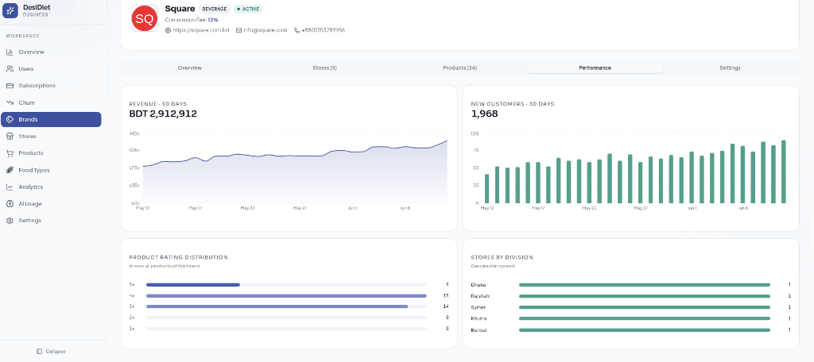
    </td>
    <td width="50%" align="center" valign="top">
      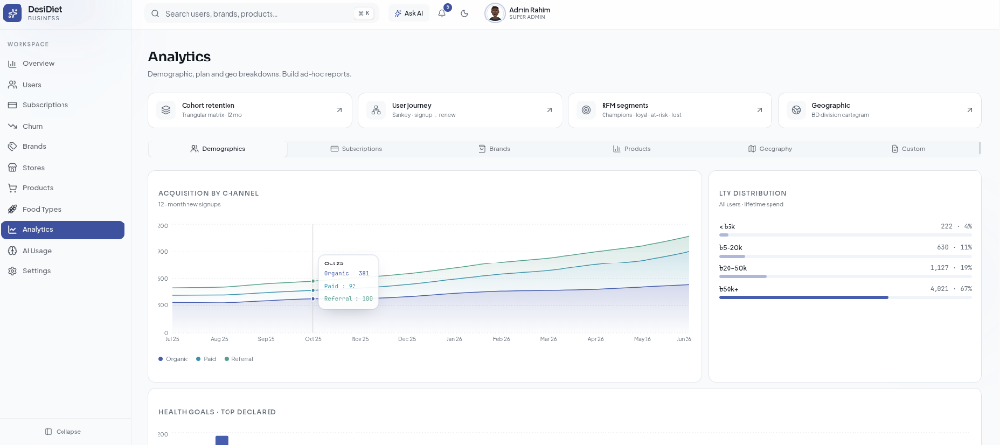
    </td>
  </tr>

  <!-- Row 4 -->
  <tr>
    <td width="50%" align="center" valign="top">
      <strong>7. AI Usage & Cost Forecasting</strong><br>
      Monitor daily LLM token consumption, estimated costs, and API request volume by feature.
    </td>
    <td width="50%" align="center" valign="top">
      <strong>8. Token Quotas & Top Consumers</strong><br>
      Track highest token consumers and manage automatic quota alerts for heavy users.
    </td>
  </tr>
  <tr>
    <td width="50%" align="center" valign="top">
      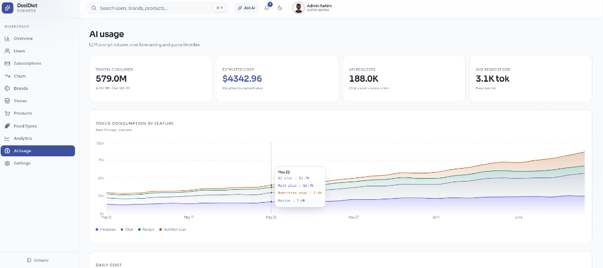
    </td>
    <td width="50%" align="center" valign="top">
      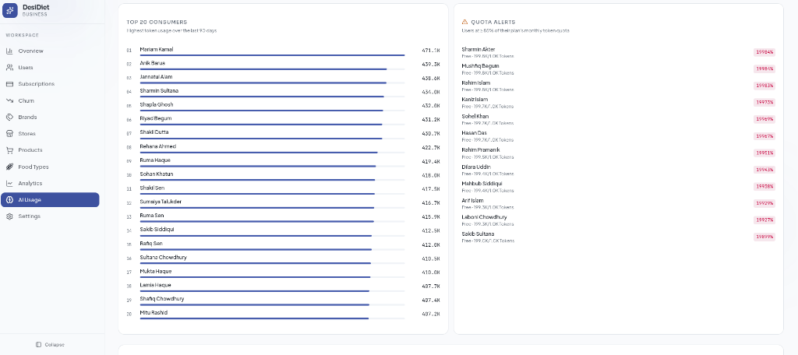
    </td>
  </tr>

  <!-- Row 5 -->
  <tr>
    <td width="50%" align="center" valign="top">
      <strong>9. Subscription Tier Management</strong><br>
      Manage free, basic, and premium pricing tiers while tracking MRR contribution and payment mix.
    </td>
    <td width="50%" align="center" valign="top">
      <strong>10. Churn Risk & Win-back Campaigns</strong><br>
      Identify cancellation reasons, predict user churn risk, and trigger automated win-back emails.
    </td>
  </tr>
  <tr>
    <td width="50%" align="center" valign="top">
      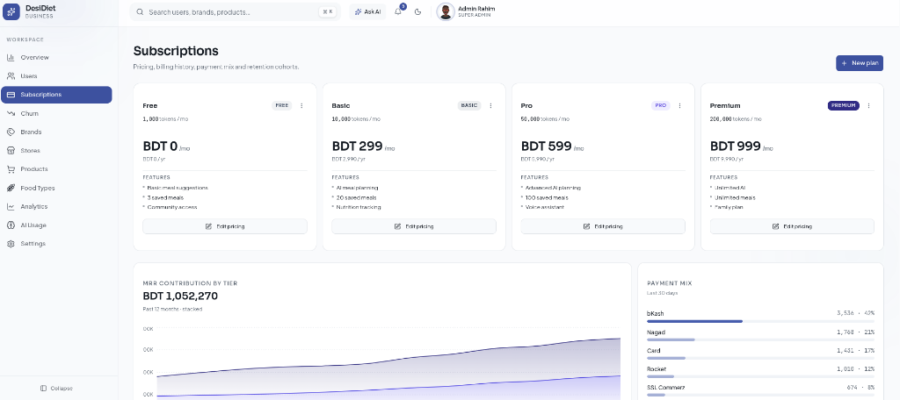
    </td>
    <td width="50%" align="center" valign="top">
      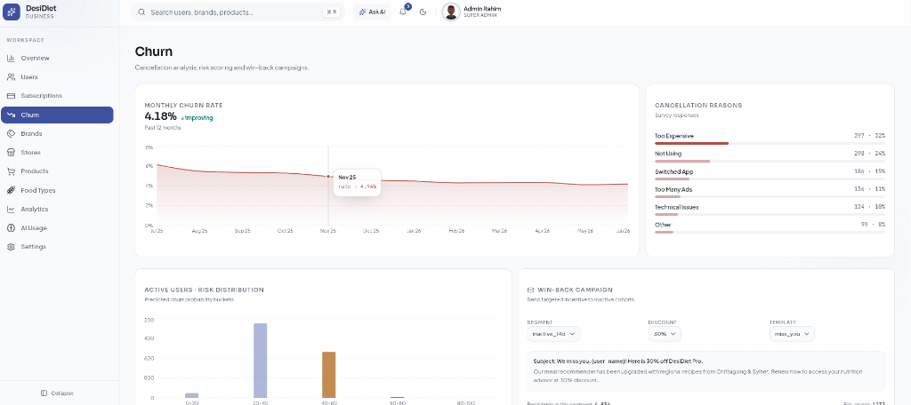
    </td>
  </tr>

  <!-- Row 6 -->
  <tr>
    <td width="50%" align="center" valign="top">
      <strong>11. Vision — Freemium & B2B Model</strong><br>
      7-day free trial + ৳300/month Pro plan (Shwapno, Chaldal, Foodpanda B2B grocery sourcing integrations).
    </td>
    <td width="50%" align="center" valign="top">
      <strong>(More B2B Integrations Coming Soon)</strong>
    </td>
  </tr>
  <tr>
    <td width="50%" align="center" valign="top">
      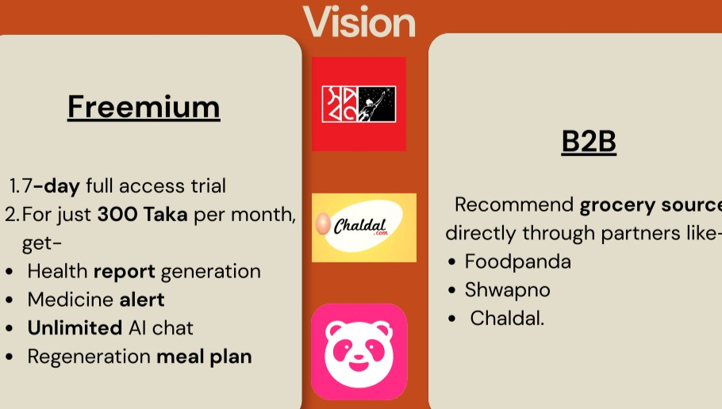
    </td>
    <td width="50%" align="center" valign="top">
      &nbsp;
    </td>
  </tr>
</table>


## System Methodology & Scientific Grounding

DesiDiet uses native South Asian nutritional formulas, structured compatibility rules, and a multi-stage workflow:

### South-Asian Adjusted Calorie Engine
*   **Basal Metabolic Rate (BMR) Formulas (Mifflin-St Jeor Equation):**
    *   *Male:* `BMR = (10 * Weight) + (6.25 * Height) - (5 * Age) + 5`
    *   *Female:* `BMR = (10 * Weight) + (6.25 * Height) - (5 * Age) - 161`
*   **Total Daily Energy Expenditure (TDEE):** `TDEE = BMR * Activity Factor`
*   **Adjusted South-Asian BMI Categories:**
    *   *Underweight:* `< 18.5`
    *   *Normal Weight:* `18.5 - 22.9`
    *   *Overweight:* `23.0 - 27.4`
    *   *Obese:* `>= 27.5`
*   **Goal Tuning:**
    *   *Loss:* `TDEE - 350 kcal`
    *   *Maintain:* `TDEE`
    *   *Gain:* `TDEE + 300 kcal`
*   **Target Macro Split (Energy):** 55% Carbohydrates | 15% Protein | 30% Fats
*   **Daily Essentials:** Fiber target of `25g/day`, Water intake target of `33 ml/kg IBW` (Ideal Body Weight)

### Food Compatibility Engine
*   **Structured Meal Assembly:** Combines local staples (Rice, Dal, Vegetables, Salad, and Fish/Meat) to suggest culturally meaningful meals rather than arbitrary ingredient lists.
*   **Compatibility Parameters:** Evaluated across six vectors: *Nutrient Complementarity, Traditional Co-occurrence, Digestibility & GI Impact, Condition Safety, Taste & Cultural Preference, and Affordability & Availability*.

### System Intelligence Pipeline
The system processes all user interactions via a 6-stage sequential workflow:
1.  **Ask / Log:** Ingress of user queries via text, voice recordings (Whisper), or food images.
2.  **Smart Routing:** The state router performs cache hits and security screening before downstream evaluation.
3.  **Data Retrieval:** Fetches real-time relational SQL data, Pinecone recipe vectors, and Neo4j graph nodes.
4.  **AI Reasoning:** LangGraph coordinates Pusti AI and NutriSaathi execution paths.
5.  **Response:** Emits real-time language-matched feedback (Bangla/English).
6.  **Learn & Improve:** Stores response characteristics for regression validation testing.

---

## Database Schema

The system relies on a dual-schema storage design to partition user transactional logs from clinical rules:

### 1. PostgreSQL Relational Schema
Details user profiles, daily calorie targets, weight charts, and meal tracking logs.
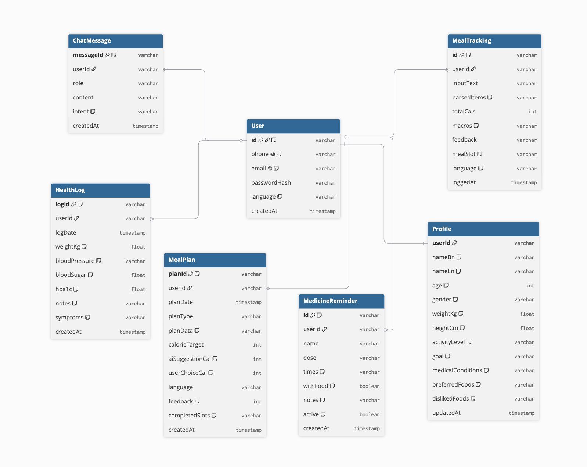

### 2. Neo4j Graph Database Schema
Models direct relationships between diseases, micro/macro nutrients, and local food items, serving as the source of truth for safe food verification.
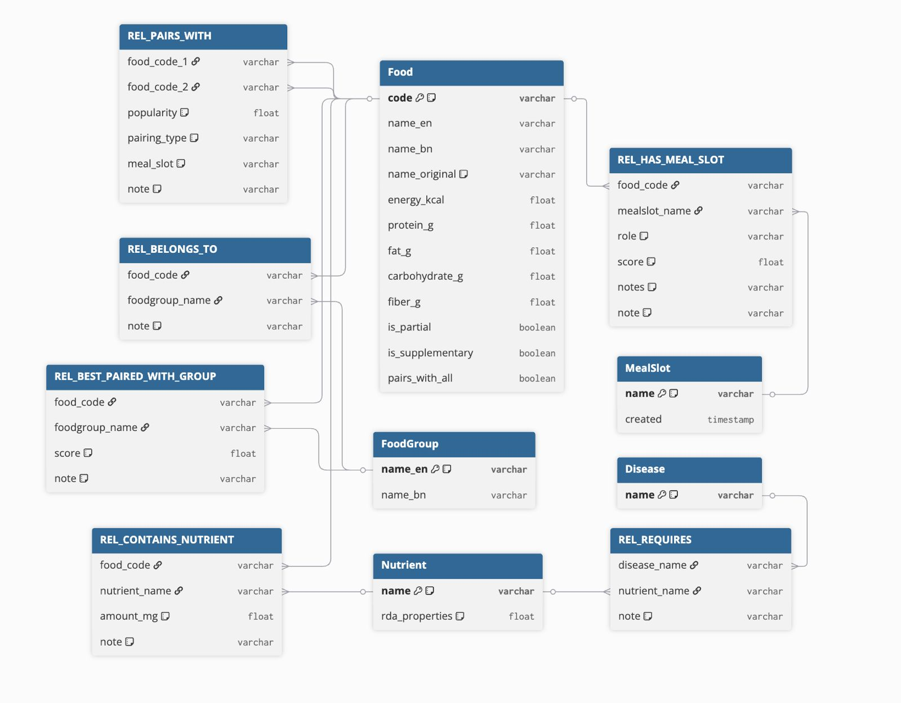


---

## Token Optimization Techniques

Strict token budget management is enforced across the application to ensure low latency and reduced LLM API costs:

1.  **Redis-Backed Semantic Caching:** Caches embeddings and responses for general queries to resolve similar questions instantly under 50ms with zero API cost.
2.  **Local Exact Match Check:** Pre-hashes query strings using MD5 to check for exact cache hits, bypassing embedding and LLM API calls completely.
3.  **Sliding History Window & Summarization:** Limits active conversational history to the last 6 turns and routes older messages to a lightweight model (`gpt-4o-mini`) to build a single concise context summary.
4.  **Local Context Pruning:** Uses a lightweight Jaccard token overlap algorithm to trim long RAG food contexts and profile details locally to fit within strict prompt token budgets.

---

## RAG Architecture Details

The system employs a dual-RAG approach to handle both structured clinical data and unstructured cooking manuals:

1.  **Vector RAG (Pinecone / NutriSaathi Cooking Assistant):**
    *   **Data Source:** Unstructured dietary/cooking manuals (`ragdata.md`).
    *   **Chunking:** Cosine similarity-based Semantic Chunking (0.65 threshold, max 1000 chars) prepended with Anthropic-style Contextual RAG summaries.
    *   **Embeddings:** Local embedding generation using `all-MiniLM-L6-v2`.
2.  **Graph RAG (Neo4j / Pusti AI Clinical Diet Logic):**
    *   **Data Source:** Structured food composition tables and clinical nutrition databases.
    *   **Chunking:** None (data is mapped directly into discrete entity nodes and relations in the Knowledge Graph).
    *   **Embeddings:** Entity-based property matching and graph traversal. Evaluates RDA and micronutrient similarity scores natively using graph algorithms.

---

## Agent Frameworks & Orchestration

The system uses **LangGraph (StateGraph)** to orchestrate two specialized sub-agents:
1.  **Pusti AI:** Clinical agent implementing clinical diet guidelines.
2.  **NutriSaathi:** Cooking agent offering step-by-step culinary guidance.

The architecture features a conditional router, memory condensation (Redis summaries), and full tool-calling support enabling the agents to:
*   Manage meal tracking and fetch daily/weekly meal plans.
*   Update user profiles and log health metrics (weight, blood sugar, BP).
*   Compile comprehensive nutrition reports and set medicine reminders.
*   Check food safety and trigger in-app page navigation.

---

## Prompt Usage & Engineering

To guarantee reliable outputs and restrict model behavior, we enforce:

1.  **Role-Play & Persona Definitions:** Distinct clinical roles guide response tone and boundaries ("Pusti AI" as a warm health intake specialist, "NutriSaathi" as a culturally grounded cooking guide).
2.  **Unicode Banners & Section Blocks:** Prompt templates are structured with explicit unicode banners (e.g., `CORE RULES`, `CONTEXT BLOCK`) to logically separate instructions, retrieved medical RAG contexts, and user profile data.
3.  **Strict Code-switching Rules:** Prompts enforce language-matching logic (returning Bengali script responses for Bengali input, and English/Banglish instructions otherwise).
4.  **Structured Markers & JSON Outputs:** Instructions direct the models to return strictly formatted JSON matching Pydantic targets or terminate intake collection with special string markers (e.g., `##DIET_DATA_COMPLETE##`) followed by a serialized dictionary.

---

## Optimization & Building Approach

The repository structure and building mechanisms were created and accelerated using:
*   **Graphify:** Automatically maps codebase relations to analyze architectural dependencies.
*   **Kiro / AWS Kiro:** Steering configuration management to automate workspace rules and code alignment.

---

## System Monitoring & Observability

We employ enterprise tools to oversee prompt performance and application health:
*   **LangSmith:** Used for LLM API monitoring, trace observability, and prompt execution tracking — covering Trace Count, Trace Latency (P50/P99), and real-time Error Rate.
*   **Custom Business & System Monitoring Dashboards:** Provides real-time metrics on user engagement, meal plans generated, and cache hit rates.

| |
|:---:|
| **LangSmith API Monitoring**<br><br>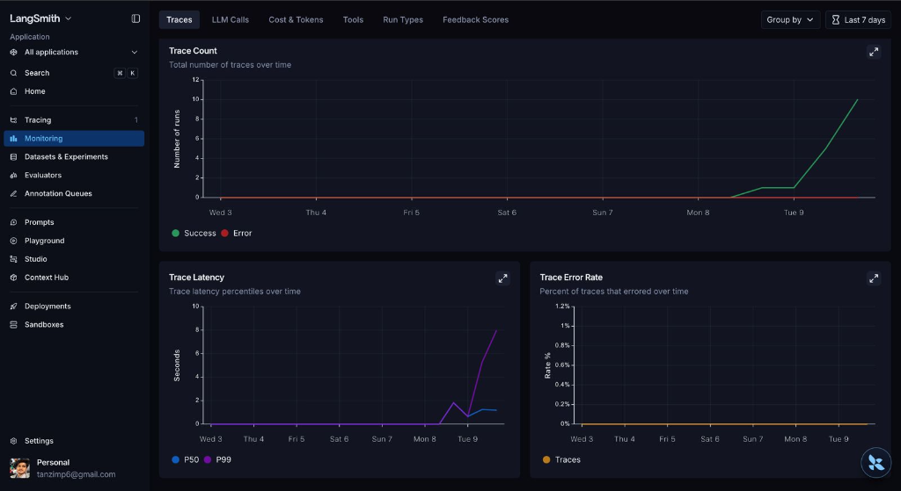 |

---

## Guardrails, Safety & Privacy

1.  **Pre-routing Safety Guardrail:** A dedicated LangGraph `SafetyGuardNode` evaluates all incoming messages using structured JSON outputs to detect and refuse prompt injection, jailbreaks, clinical diagnoses, and drug prescription queries before downstream routing.
2.  **Database Context Isolation:** Out-of-scope queries trigger immediate exit states, completely bypassing Vector (Pinecone) and Graph (Neo4j) database connections to prevent unauthorized data access/leaks.
3.  **Cache PII Protection:** The `TokenOptimizer.is_cacheable` logic parses query words to prevent user-specific metrics or personal details from entering the shared Redis semantic cache.

---

## Open Source Tools & Libraries

*   **LangGraph:** Multi-agent state management and execution graph orchestration.
*   **Fastembed (Qdrant):** Local `all-MiniLM-L6-v2` vector embeddings.
*   **Neo4j:** Clinical Knowledge Graph queries.
*   **Pinecone:** Recipe vector storage.
*   **Redis:** Semantic caching and conversational summaries.
*   **Prisma Client:** Database ORM for relational queries.
*   **FastAPI:** Server endpoints and Server-Sent Events (SSE) chat streaming.

---

## Evaluation & Quality Measurement

A custom validation suite executes regression checks:
1.  **Recommendation Stability:** Verifies personalization variance among various demographic groups (Age/Gender/RDA keys).
2.  **Nutrient Coverage:** Confirms top recommendations meet clinical RDA targets.
3.  **Regression Testing:** Measures token optimization metrics including semantic cache hit rates, Jaccard-based context pruning overlaps, and latency distribution.
4.  **Manual Safety Audits:** Ensures clinical constraints are strictly grounded in BIRDEM/WHO guidelines.

---

## Quick Start

### Prerequisites
*   Python 3.11+
*   Node.js 18+
*   PostgreSQL & Redis
*   Neo4j instance (Local or AuraDB)
*   OpenAI API Key

### Backend Ingress
```bash
cd backend
python -m venv venv
source venv/bin/activate

# Install and init ORM
pip install -r requirements.txt
cp .env.example .env
python -m prisma generate
python -m prisma db push

# Start Server
uvicorn app.main:app --reload --host 0.0.0.0 --port 8000
```

### Frontend Web Build
```bash
cd frontend
npm install
echo "VITE_API_URL=http://localhost:8000" > .env
npm run dev
```

### WhatsApp Microservice
```bash
cd whatsapp-service
npm install
npm run dev
```
