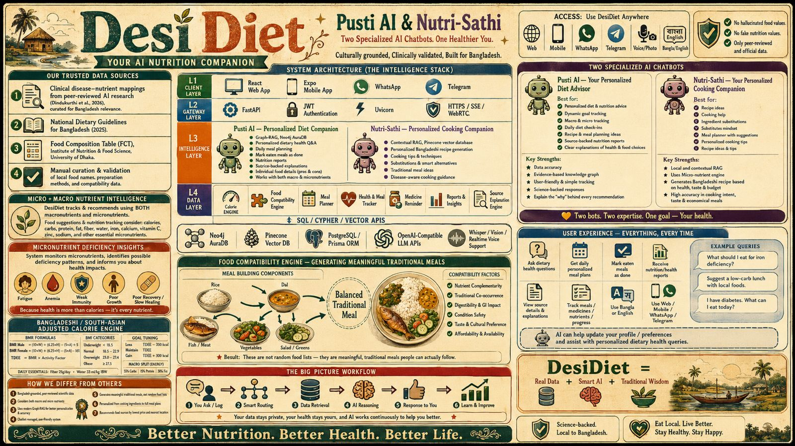
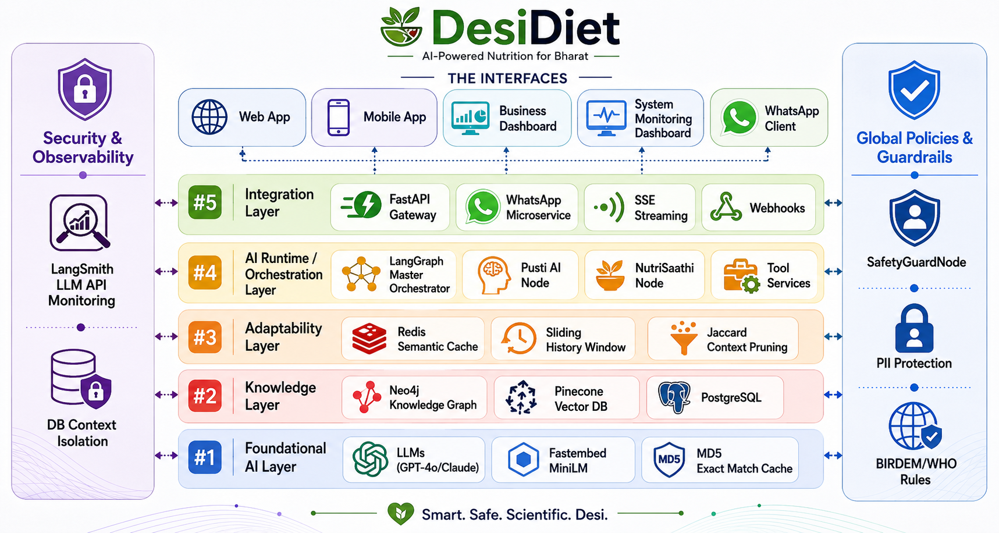

# DesiDiet — AI-Native Clinical Nutrition & Meal Planning

> **Proudly Built for Infinity AI Buildfest 2026 @ BRAC University**
> Deployed at Vercel & Railway.



---

## Executive Summary & Core Innovation
DesiDiet is an enterprise-grade, culturally grounded, clinical nutrition ecosystem for South Asian dietary profiles. It implements a 5-layer AI architecture using **Pusti AI** and **NutriSaathi** agents orchestrated via **LangGraph** and grounded in clinical nutrition datasets.

---

## Key Features
*   **Personalized Meal Planning:** AI daily/weekly plans matching user profile, medical conditions, and NDG 2025 guidelines.
*   **Conversational AI Diet Assistant:** Real-time streaming SSE chat with full user profile context.
*   **Meal Logging via Speech & Vision:** Bilingual voice (Whisper) or photo food logging verified via Neo4j database lookups.
*   **Health Log & Trend Tracking:** Progress mapping for weight, blood pressure, blood sugar, and HbA1c.
*   **Food Knowledge Browser:** Multilingual search showing nutrient breakdowns and condition safety ratings (safe/avoid).
*   **Health & Nutrition Reports:** PDF email reports analyzing calorie trends, macros, and clinical insights.
*   **Medicine Reminder Parsing:** Extracts schedule details from natural language to set structured reminders.
*   **Interactive Meal Builder:** Interactive meal calculator with target matching and AI feedback.
*   **NutriSaathi Cooking Guide:** Personalized cooking assistant generating local recipes with health substitutions.
*   **Bilingual Interface:** Entire application fully localized in Bengali and English.
*   **Grocery Sourcing & Price Compare:** Price-sorted local ingredient recommendations from nearest shops via GPS.

---

## Dataset & Integration Sources
*   **Open Datasets:** [National Dietary Guidelines (2025)](docs/NationalDietaryGuidelinesforBangladesh-23Aug2025.pdf), [Bangladeshi Food Composition Tables (FCT)](docs/FCT_10_2_14_final_version.pdf), and clinical schemas from [GraphRAG study](docs/frai-9-1808444.pdf) (Dindukurthi et al., 2026).
*   **External APIs:** OpenAI API (Whisper/GPT orchestration) and Pinecone Vector Database.
*   **Internal Systems:** PostgreSQL (via Prisma ORM) for user metrics and Neo4j for clinical relation graphs.
*   **Synthetic Data:** Automatically generated pairing matrices validated programmatically via AST.

---

## System Methodology & Scientific Grounding

### Mifflin-St Jeor Calorie Engine
*   *Male:* `BMR = 10W + 6.25H - 5A + 5` | *Female:* `BMR = 10W + 6.25H - 5A - 161`
*   *TDEE:* `BMR * Activity Factor`
*   *South-Asian BMI:* Underweight `<18.5`, Normal `18.5-22.9`, Overweight `23.0-27.4`, Obese `>=27.5`
*   *Target Macro Split:* 55% Carbs | 15% Protein | 30% Fats. Fiber target: `25g/day`. Water: `33ml/kg`.

### Food Compatibility Engine
*   **Traditional Assembly:** Suggests balanced regional plates (Rice, Dal, Veg, Salad, Meat/Fish) instead of random items.
*   **Vetting Parameters:** Complementarity, traditional co-occurrence, GI impact, condition safety, cultural preference, cost.

### Processing Workflow
1. **Ask/Log** (Voice/Vision/Text) $\rightarrow$ 2. **Smart Routing** (Cache/Safety checks) $\rightarrow$ 3. **Data Retrieval** (SQL/Neo4j/Pinecone) $\rightarrow$ 4. **AI Reasoning** (LangGraph agents) $\rightarrow$ 5. **Response** (Bilingual streaming) $\rightarrow$ 6. **Improvement** (Validation checks).

---

## Technical Execution & System Architecture



### Production-Ready Features
*   **Latency:** SSE streaming chat responses resolved under 50ms for cached queries.
*   **Integrity:** Relational session storage in PostgreSQL with type-safe schema validation via Prisma.
*   **Verification:** Image/voice tags mapped to database codes prior to logging (blocks hallucinated inputs).
*   **Roadmap:** Maternal health and family planning module slated for the upcoming version.

---

## Database Schema
*   **PostgreSQL:** Stores user profiles, calorie targets, weight charts, and meal logs.
*   **Neo4j:** Stores nodes and relations for clinical constraints, diseases, and food composition specs.

---

## Token Optimization Techniques
1.  **Redis Semantic Caching:** Returns sub-50ms responses for similar semantic queries.
2.  **MD5 Exact Match Check:** Pre-hashes input queries to resolve greetings/recurrent queries instantly.
3.  **Sliding Window & Summarization:** Houses active history (6 turns) and condenses old turns via `gpt-4o-mini`.
4.  **Local Context Pruning:** Jaccard overlap algorithm trims RAG food contexts locally to fit prompt limits.

---

## RAG Architecture Details
1.  **Vector RAG (Pinecone):** Indices unstructured cooking manual (`ragdata.md`) using Semantic Chunking (0.65 threshold) with Contextual RAG summaries. Local embeddings generated via `all-MiniLM-L6-v2`.
2.  **Graph RAG (Neo4j):** Traverses structured food-disease entity node relations directly in database (no chunking/embeddings needed).

---

## Agent Frameworks & Orchestration
**LangGraph (StateGraph)** coordinates:
*   **Pusti AI:** Clinical nutrition agent.
*   **NutriSaathi:** Localized cooking assistant.
Includes conditional routing, memory condensation, and tools for meal tracking, logging, health reports, reminders, safety checking, and UI navigation.

---

## Prompt Engineering & Usage
1.  **Role Play:** Scopes agent personas strictly to warm intake specialist or cultural chef.
2.  **Unicode Banners:** Explicit banner sections (e.g. `CORE RULES`, `CONTEXT BLOCK`) isolate rules from data.
3.  **Code-switching:** Matches Bengali or English based on user input.
4.  **JSON Targets:** Directs model outputs to structured JSON or triggers completion tags (`##DIET_DATA_COMPLETE##`).

---

## Build & Monitoring Approach
*   **Build Optimization:** Automated codebase analysis using **Graphify** and config management via **Kiro / AWS Kiro**.
*   **Monitoring:** Trace/prompt testing via **LangSmith** and Custom Business/System status dashboards.

---

## Guardrails, Safety & Privacy
1.  **Pre-routing safety:** `SafetyGuardNode` detects/refuses jailbreaks and drug inquiries before agent routing.
2.  **Context Isolation:** Out-of-scope inputs bypass Pinecone/Neo4j endpoints completely.
3.  **PII Protection:** Caching filter checks prevent personal parameters from entering the Redis cache.

---

## Open Source Stack
*   **LangGraph:** Multi-agent state orchestration.
*   **Fastembed:** Local all-MiniLM-L6-v2 vector embeddings.
*   **Neo4j & Pinecone:** Graph and vector search engines.
*   **Redis & PostgreSQL:** Cache and transaction persistence.
*   **FastAPI & Prisma:** Web endpoint streaming and relational ORM.

---

## Evaluation & Quality Measurement
Custom validation suite runs checks for:
1.  **Stability:** Personalization variance check across demographic groups.
2.  **Nutrient Coverage:** RDA target compliance test.
3.  **Token/Latency:** Semantic cache hit-rate and latency regression checks.
4.  **Safety Audits:** Grounds advice in BIRDEM/WHO guidelines.

---

## Screenshots

| Dashboard Overview | AI Diet Assistant |
|:---:|:---:|
|  |  |
| **Personalized Meal Plan** | **Grocery Compare** |
|  |  |
| **Medicine Reminders** | **Food Database** |
|  |  |
| **Comprehensive Health Report** | |
|  | |

---

## Quick Start

### Prerequisites
*   Python 3.11+, Node.js 18+, PostgreSQL, Redis, Neo4j, OpenAI API Key.

### Backend
```bash
cd backend
python -m venv venv && source venv/bin/activate
pip install -r requirements.txt
cp .env.example .env
python -m prisma generate && python -m prisma db push
uvicorn app.main:app --reload --host 0.0.0.0 --port 8000
```

### Frontend
```bash
cd frontend
npm install && echo "VITE_API_URL=http://localhost:8000" > .env
npm run dev
```

### WhatsApp microservice
```bash
cd whatsapp-service
npm install && npm run dev
```
