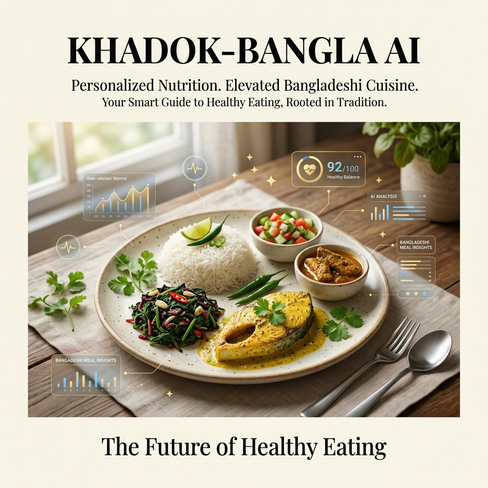
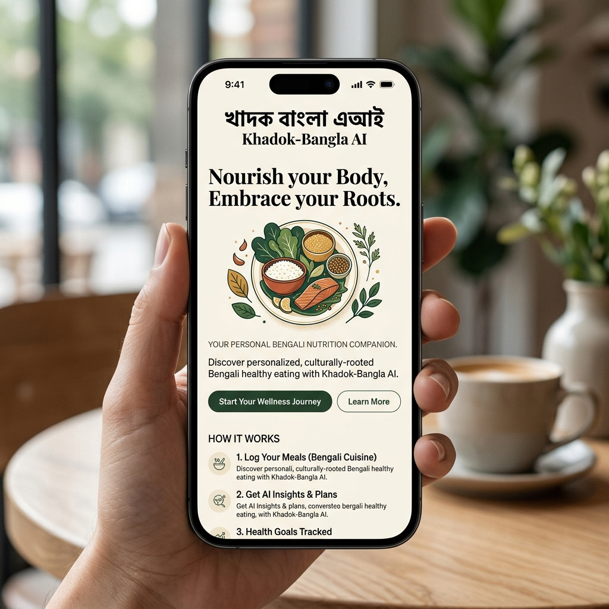
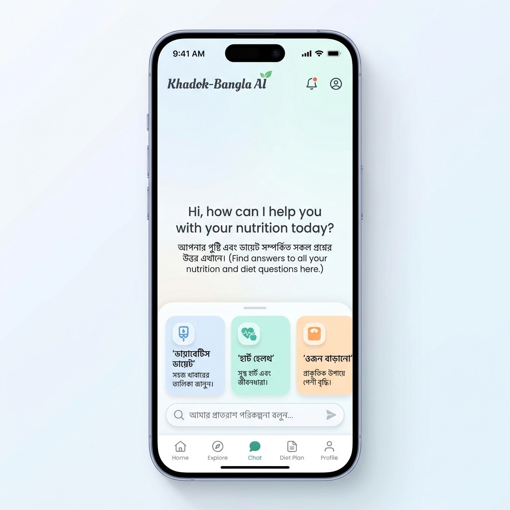

# DesiDiet AI

> **Your Personal Nutrition Companion, Powered by Science and Tradition.**

DesiDiet AI is a production-grade nutrition assistant specifically designed for the Bangladeshi lifestyle. Grounded in the **National Dietary Guidelines (NDG) Bangladesh 2025**, it provides personalized meal plans, health tracking, and AI-driven dietary advice in both **Bengali** and **English**.



## Premium Experience

Our platform combines world-class AI technology with a deep respect for Bangladeshi culinary traditions.

| Landing Page (Mobile) | Chat Interface (AI) |
| :---: | :---: |
|  |  |

---

## System Architecture
DesiDiet AI is built on the **Infinity AI Buildfest 2026 AI-Native Application Blueprint**. For a comprehensive breakdown of our 8-layer enterprise architecture, please see the [System Architecture Documentation](../docs/architecture.md).

---

## Key Features

### 1. AI Chat Assistant (SSE Streaming)
A modern, conversational AI chat interface capable of generating intelligent meal plans and answering nutritional questions based on local Bangladeshi context. Responses stream in real-time for an incredibly fast and fluid experience.
### 2. Customizable AI Meal Plans
- **Dynamic Generation:** AI creates full daily and weekly meal plans tailored specifically to your age, gender, BMI, activity level, and medical conditions (e.g., Diabetes, Hypertension).
- **Editable Slots:** Full control over your diet! Click the "কাস্টমাইজ" (Customize) button to edit AI suggestions. Remove unwanted foods or add new ones inline, directly inside meal slots.
- **Calorie Tracking:** The UI dynamically tracks the original **AI Suggestion** vs **Your Choice** as you customize your daily intake.

### 3. GraphRAG Food Database
- **Safe Foods Explorer:** Automatically filters and ranks over 370+ local Bangladeshi foods based on your specific health profile (Medical Conditions & Goals) using a powerful Neo4j Knowledge Graph.
- **Insightful Search:** Search for any food (e.g., *Mango*, *Rui Fish*) and receive immediate, AI-generated personalized safety insights directly in the results.

### 4. Health Logging & Trends
- Log your daily weight, blood pressure, blood sugar, and HbA1c.
- Interactive, beautifully animated trend charts (powered by Recharts) visualize your progress over time.

### 5. Smart Medicine Reminders
- Add reminders using natural language (e.g., *"Take Metformin 500mg in the morning and night after food"*).
- The system automatically parses the medication name, dosage, and schedule.

### 6. 9-Step Profile Setup Wizard
- A beautifully designed, conversational onboarding flow to collect critical biometric data and dietary preferences to power the AI engine.

### 7. Bilingual Design (i18n)
- Seamlessly switch between **Bengali** and **English** with deep integration throughout the entire application.
- "Magazine-style" typography paired with brutalist and organic design elements.

---

## Tech Stack

- **React 18 + TypeScript** - Strongly typed component architecture.
- **Vite** - Lightning-fast build tool and development server.
- **Tailwind CSS v3** - Utility-first styling for complex, responsive designs.
- **Framer Motion** - Fluid micro-interactions and page transitions.
- **Lucide React** - Clean, modern iconography.
- **Recharts** - Dynamic data visualization for health trends.
- **React-i18next** - Robust internationalization logic.

---

## Getting Started

### Prerequisites
Make sure your FastAPI backend and Neo4j database are running locally first!

### Installation
```bash
# 1. Navigate to the frontend directory
cd frontend

# 2. Install dependencies
npm install

# 3. Start development server
npm run dev
```

### Environment Setup
Create a `.env` file in the root of the frontend folder:
```env
# Forces all API calls to route through the Vite development proxy
VITE_API_URL=
```

---
Developed with ❤️ for the people of Bangladesh.
