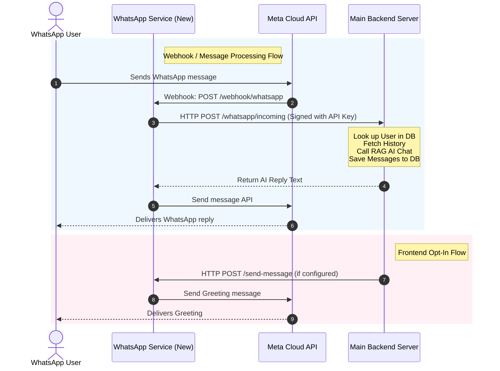

# Implementation Plan: Standalone WhatsApp Integration Service

This plan outlines separating the WhatsApp Cloud API integration into a dedicated, standalone service. The new service will handle the Meta webhook and outgoing messages, communicating with the main backend server via secure HTTP endpoints, leaving the existing backend functionality completely intact and backward-compatible.

> **Status:** ✅ **IMPLEMENTED** — all files and modifications described below are in place.

---

## Architecture Overview

The standalone WhatsApp service will act as a lightweight, stateless proxy between Meta Cloud and the Pushti AI main backend:



---

## User Review Required

> [!NOTE]
> **No Database Access Needed for Standalone Service**:
> The standalone service does not need direct access to the PostgreSQL database or Prisma. It delegates all database operations (user lookups, message logging) and AI RAG generations to the main backend via a secure HTTP endpoint (`/whatsapp/incoming`). This makes the new service lightweight, secure, and trivial to deploy on a separate server.

> [!IMPORTANT]
> **API Key Authentication**:
> To secure communication between the two servers, we will implement custom API Key authorization using the header `X-WhatsApp-Service-Key`. This key must be configured symmetrically on both servers.

---

## Proposed Changes

### 1. New Standalone Service: `whatsapp-service/`

We will create a new directory `whatsapp-service` in the root workspace.

#### [NEW] [main.py](file:///home/lamizubi/Projects/pushti/whatsapp-service/main.py) ✅
A lightweight FastAPI app containing:
- Verification endpoint: `GET /webhook/whatsapp`
- Webhook receiver endpoint: `POST /webhook/whatsapp` (extracts payload and forwards to main backend `/whatsapp/incoming`, then sends response back to user)
- Outgoing message sender endpoint: `POST /send-message` (allows main backend to trigger outgoing template/opt-in messages)
- Health check: `GET /health`

#### [NEW] [config.py](file:///home/lamizubi/Projects/pushti/whatsapp-service/config.py) ✅
Pydantic Settings loader for the standalone service.

#### [NEW] [requirements.txt](file:///home/lamizubi/Projects/pushti/whatsapp-service/requirements.txt) ✅
Dependencies: `fastapi`, `uvicorn`, `httpx`, `pydantic-settings`, `python-dotenv`.

#### [NEW] [.env.example](file:///home/lamizubi/Projects/pushti/whatsapp-service/.env.example) ✅
Template environment variables:
- `PORT` (default `8010`)
- `WHATSAPP_TOKEN`
- `PHONE_NUMBER_ID`
- `WHATSAPP_VERIFY_TOKEN`
- `MAIN_SERVER_URL`
- `WHATSAPP_SERVICE_API_KEY` (Secret shared key)

#### [NEW] [Dockerfile](file:///home/lamizubi/Projects/pushti/whatsapp-service/Dockerfile) ✅
To facilitate easy containerized deployment.

#### [NEW] [README.md](file:///home/lamizubi/Projects/pushti/whatsapp-service/README.md) ✅
Detailed startup instructions and connection setup.

---

### 2. Main Server Backend

We will modify the main server backend to expose an incoming message handler and redirect opt-in requests when the standalone service is enabled.

#### [MODIFY] [config.py](file:///home/lamizubi/Projects/pushti/backend/app/config.py) ✅
Add:
- `whatsapp_service_url`: Optional HTTP URL of the standalone WhatsApp service.
- `whatsapp_service_api_key`: Shared secret key for communication.

> **Already present** in `backend/app/config.py` (lines 52–54).

#### [MODIFY] [whatsapp.py](file:///home/lamizubi/Projects/pushti/backend/app/routers/whatsapp.py) ✅
- **Add** `POST /whatsapp/incoming`:
  - Receives `{ "phone": "...", "message": "..." }`.
  - Verifies the `X-WhatsApp-Service-Key` header.
  - Normalizes phone number, performs user lookup.
  - Fetches last 10 messages from DB.
  - Obtains access token, invokes RAG, saves history, and returns JSON reply.
- **Refactor** shared logic (`_handle_incoming_message`, `_resolve_user`, `_build_history`, `_generate_reply`, `_save_messages`) so the direct webhook (`POST /webhook/whatsapp`) and the new proxy endpoint both use the same code path.
- **Update** `POST /whatsapp/optin`:
  - If `WHATSAPP_SERVICE_URL` is set, forward the message sending request to the standalone service's `POST /send-message` endpoint.
  - If not set, fall back to the existing direct Meta API call behavior (keeping existing system fully functional).

> **Already implemented** in `backend/app/routers/whatsapp.py`.

---

## Environment Variables Reference

| Variable | Location | Purpose |
|----------|----------|---------|
| `WHATSAPP_TOKEN` | Both | Meta Cloud API permanent access token |
| `PHONE_NUMBER_ID` | Both | Meta phone number ID |
| `WHATSAPP_VERIFY_TOKEN` | Both | Webhook verification token |
| `WHATSAPP_SERVICE_URL` | Main backend only | URL of the standalone service (empty = direct mode) |
| `WHATSAPP_SERVICE_API_KEY` | Both | Shared secret for inter-service auth |
| `MAIN_SERVER_URL` | Standalone service only | Base URL of the main backend |
| `BACKEND_URL` | Main backend only | Self-referential URL for RAG `/chat` calls |

---

## Deployment Notes

### Running Locally

```bash
# Terminal 1 — main backend
cd backend
source venv/bin/activate
uvicorn app.main:app --reload --port 8000

# Terminal 2 — standalone WhatsApp service
cd whatsapp-service
python -m venv venv && source venv/bin/activate
pip install -r requirements.txt
cp .env.example .env
# edit .env
uvicorn main:app --reload --port 8010
```

### Running with Docker

```bash
cd whatsapp-service
docker build -t pushti-whatsapp-service .
docker run -p 8010:8010 --env-file .env pushti-whatsapp-service
```

### Meta Webhook Configuration

1. Point your Meta app webhook to the **standalone service**:
   ```
   https://<your-ws-domain>/webhook/whatsapp
   ```
2. Subscribe to `messages` webhook events.
3. Ensure the verify token matches `WHATSAPP_VERIFY_TOKEN`.

---

## Verification Plan

### Automated/Unit Verification ✅
We will write a python test script `/home/lamizubi/Projects/pushti/backend/app/personal_cooker/test_whatsapp_service.py` to mock and verify:
1. Health check on the standalone service (`GET /health`).
2. Sending a WhatsApp message via the new service's `POST /send-message` endpoint.
3. The endpoint `POST /whatsapp/incoming` on the main server behaves correctly when called with the appropriate headers (looking up mock users, storing to DB, and replying).

Run tests:
```bash
cd backend
source venv/bin/activate
python -m app.personal_cooker.test_whatsapp_service
```

### Manual Verification
1. Spin up the `whatsapp-service` locally on port `8010`.
2. Test sending a simulated webhook message to the standalone service to confirm it forwards to the main backend and gets a proper AI answer.

---

## Rollback Plan

If the standalone service causes issues in production:

1. **Stop** the standalone service container / process.
2. **Unset** `WHATSAPP_SERVICE_URL` in the main backend environment (or leave it empty).
3. **Point** the Meta webhook URL directly back to the main backend:
   ```
   https://<your-backend-domain>/webhook/whatsapp
   ```
4. The existing `POST /webhook/whatsapp` endpoint remains fully functional because it was never removed—only refactored to share code with the new `/whatsapp/incoming` endpoint.
